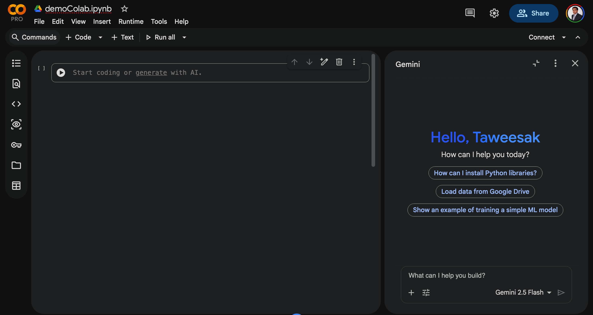
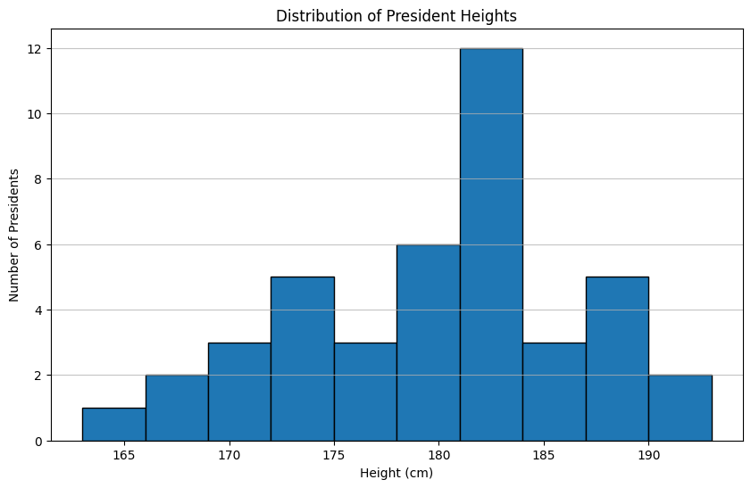
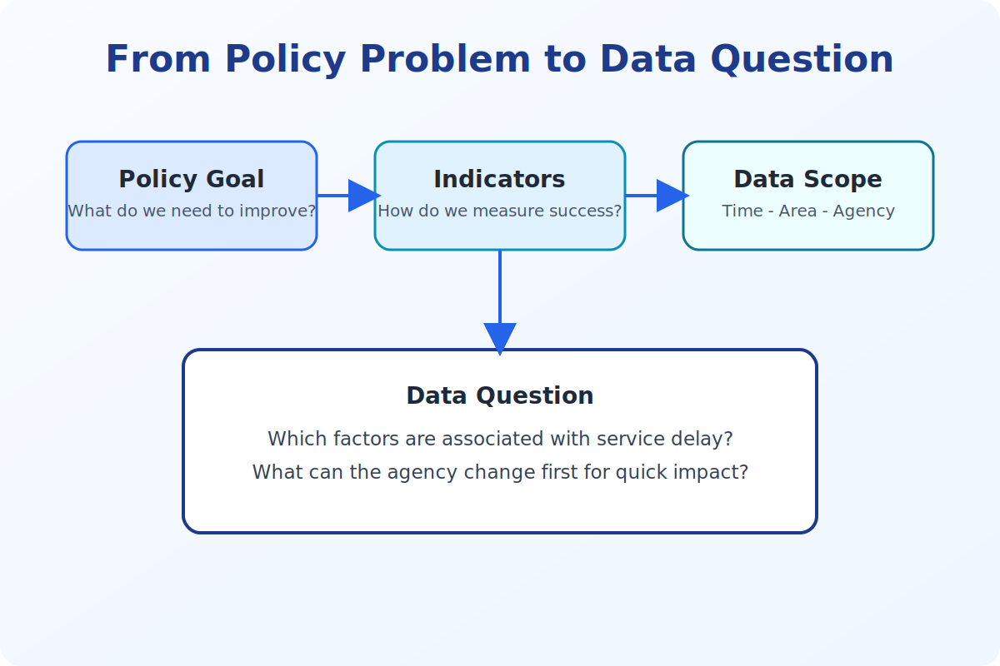

<!-- _class: lead -->

<style scoped>
.logo-bar { position: absolute; top: 36px; right: 64px; display: flex; align-items: center; gap: 16px; }
.logo-bar img { width: 100px; height: 100px; object-fit: contain; }
</style>

<div class="logo-bar">
  
  
</div>


# Session 02

# การสำรวจและวิเคราะห์ข้อมูลด้วย Generative AI และ Google Colab

Stat on Campus: Data innovators 
Turning data into impact for public sector

Asst. Prof. Taweesak Samanchuen, Ph.D.
Mahidol University

---

## วัตถุประสงค์ของ Session

เมื่อจบช่วงนี้ ผู้เข้าอบรมสามารถ:

1. เริ่มใช้งาน Google Colab ได้ แม้ไม่เคยใช้งานมาก่อน
2. เข้าใจบทบาทของ AI ภายใน workflow การวิเคราะห์ข้อมูลใน Colab
3. แปลงโจทย์เชิงนโยบายเป็นคำถามเชิงข้อมูลได้
4. ตรวจสอบและเตรียมข้อมูลก่อนวิเคราะห์ได้เป็นระบบ
5. ใช้ Generative AI ช่วยสำรวจข้อมูลเบื้องต้นได้


---

## สารบัญ 

1. Colab สำหรับผู้เริ่มต้น
2. Basic Python + AI Prompting for Data Analysis
3. การเตรียมข้อมูลสำหรับการวิเคราะห์
4. Exploratory Data Analysis (EDA)
5. Workshop 2: เตรียมข้อมูลและสำรวจข้อมูลด้วย AI

---
## สร้างภาพด้วย Gemini 

### Prompt 
```prompt
สร้างภาพ super hero ของตัวฉันเองในสไตล์การ์ตูนญี่ปุ่น พร้อมฉากหลังเป็นเมืองใหญ่ในยามค่ำคืน และใส่ข้อความ 
"AI Data Hero" ที่ด้านล่างของภาพ 
```

- เขียน prompt ตามตัวอย่างนี้ 
- แนบรูปภาพของคุณเองเพื่อให้ AI สร้างภาพ super hero ที่มีลักษณะคล้ายคุณ

---
## ทดลองวิเคราะห์ข้อมูลด้วย Gemini  


1. ดาวโหลดไฟล์ presidents.csv ที่
https://github.com/toche7/DataSets/blob/main/president_heights.csv
2. เปิดใช้งาน gemini.google.com
3. เปิด chat ใหม่และ add ไฟล์ president_heights.csv ที่ดาวน์โหลดจาก GitHub


4. พิมพ์ prompt เช่น
```prompt
ช่วยวิเคราะห์ข้อมูลความสูงของประธานาธิบดีในไฟล์นี้ และตอบคำถามต่อไปนี้: ความสูงเฉลี่ย ความสูงมากสุด 
และน้อยสุด พร้อมสร้างกราฟการกระจายความสูงด้วย
```

---
## เปรียบภาพที่ได้จาก Super Hero กับภาพ Histogram

- ภาพ super hero เป็นผลลัพธ์จากการใช้ AI สร้างภาพตามคำอธิบายที่ให้ไป ซึ่งเป็นการสร้างสรรค์ที่ไม่จำกัดและมีความยืดหยุ่นสูง
- ภาพ Histogram เป็นการแสดงข้อมูลเชิงสถิติที่แสดงการกระจายของข้อมูล ซึ่งมีความแม่นยำและเป็นทางการมากกว่า
- ทั้งสองภาพมีจุดประสงค์และการใช้งานที่แตกต่างกัน โดยภาพ super hero เน้นความสร้างสรรค์และการสื่อสารที่น่าสนใจ ในขณะที่ Histogram เน้นการวิเคราะห์ข้อมูลและการสื่อสารข้อมูลเชิงปริมาณอย่างชัดเจน
### ใช้เทคโนโลยีที่ต่างกันคือ
- ภาพ super hero ใช้ Generative AI (model: nano-Banana) ในการสร้างสรรค์ภาพตามคำอธิบายที่ให้ไป
- ภาพ Histogram ใช้เทคนิคการวิเคราะห์ข้อมูลและการสร้างกราฟจากข้อมูลที่มีอยู่แล้ว โดยอาจใช้เครื่องมือเช่น Python, R หรือซอฟต์แวร์วิเคราะห์ข้อมูลอื่น ๆ ในการสร้างกราฟนี้


---

<!-- _class: lead -->

# Colab สำหรับผู้เริ่มต้น

---

## Colab คืออะไร ทำไมต้องใช้ Colab ในการวิเคราะห์ข้อมูลด้วย AI

<div class="columns">
<div>

### Colab คืออะไร

- แพลตฟอร์มโน้ตบุ๊กออนไลน์ที่ Google ให้บริการฟรี
- รองรับการเขียนโค้ด Python และการใช้ AI ช่วยเขียนโค้ดได้ในที่เดียว
- เหมาะสำหรับการวิเคราะห์ข้อมูลที่ต้องการความยืดหยุ่นและตรวจสอบได้

### สิ่งที่ผู้เรียนส่วนใหญ่กังวล

- ไม่เคยเขียนโค้ดมาก่อน
- ไม่แน่ใจว่าจะเริ่มจากปุ่มไหน
- กลัวพิมพ์ผิดแล้วใช้งานต่อไม่ได้

</div>
<div class="center">


</div>
</div>

---

## ทำไม Session นี้ต้องใช้ Colab (ไม่ใช้ AI Chat โดยตรง)

### เหตุผลหลัก

1. **ทำงานวิเคราะห์ได้จริง:** Colab ช่วยให้เราทำงานกับข้อมูลจริงได้ ตั้งแต่การโหลดข้อมูล, ทำความสะอาด, วิเคราะห์ และสร้างกราฟในที่เดียว
2. **ตรวจสอบได้:** ทุกขั้นตอนการวิเคราะห์ถูกบันทึกใน Notebook เดียว ทำให้สามารถตรวจสอบย้อนกลับและทำซ้ำได้ง่าย
3. **เรียนรู้การใช้ AI ใน workflow จริง:** การใช้ AI ช่วยเขียนโค้ดใน Colab เป็นทักษะที่สำคัญในการทำงานวิเคราะห์ข้อมูลยุคใหม่ ซึ่งไม่สามารถเรียนรู้ได้จากการใช้ AI Chat อย่างเดียว


### สรุป

> AI Chat อย่างเดียว "ตอบได้เร็ว" แต่ Colab + AI "ทำงานวิเคราะห์ได้จริงและตรวจสอบได้"

---

## เปรียบเทียบ: AI Chat โดยตรง vs Colab + AI

| ประเด็น | AI Chat โดยตรง | Colab + AI |
|---|---|---|
| การเก็บขั้นตอน | กระจัดกระจายตามบทสนทนา | อยู่ใน Notebook เดียว |
| การทำซ้ำผลลัพธ์ | ทำได้ยาก | ทำได้ง่าย (Run all) |
| การตรวจสอบย้อนกลับ | จำกัด | ชัดเจนและตรวจสอบได้ |
| ความพร้อมใช้งานหน้างาน | ปานกลาง | สูง |

### สรุป: Colab + AI เหมาะสำหรับการวิเคราะห์ข้อมูลที่ต้องการความถูกต้องและตรวจสอบได้ ในขณะที่ AI Chat เหมาะสำหรับการตอบคำถามหรือสร้างโค้ดอย่างรวดเร็วในขั้นตอนแรก


---

## Workshop 1: Quick Start Colab (สำหรับผู้เริ่มต้น)

### 5 ขั้นตอนแรกที่ต้องทำ

1. ไปที่ https://colab.research.google.com/ และเลือก "New Notebook"
2. ตั้งชื่อไฟล์ให้สื่อความหมายของโจทย์
3. ทดลองใช้งาน Code Cell: เช่น x = 10; y = 20; print(x + y)
4. ทดลองใช้งาน Text Cell: เขียนคำอธิบายสั้นๆ ว่า "นี่คือการทดสอบ Text Cell"
5. ทดลอง upload ข้อมูล : presidents.csv จากเครื่องขึ้น Colab (ไอคอนโฟลเดอร์ > Upload)
   https://github.com/toche7/DataSets/blob/main/president_heights.csv
6. รันโค้ดอ่านไฟล์ด้วย pandas: 


### กติกาในคาบ
- ไม่ต้องกลัวพิมพ์ผิด แก้ไขได้เสมอ

---

## ภาพรวมหน้าจอ Gemini in Colab

<div class="columns">
<div>

### จุดที่ผู้เรียนควรรู้ก่อนเริ่ม

- พื้นที่เขียนโค้ดอยู่ใน Code Cell
- คำสั่งอธิบายงานให้ AI อยู่ใน Text/Prompt
- กดรันทีละเซลล์เพื่อเช็กผลลัพธ์ทันที
- ถ้าผลไม่ถูกต้อง ให้ปรับ prompt แล้วรันใหม่

</div>
<div class="center">



</div>
</div>


---

## ตัวอย่างโค้ดอ่านไฟล์ CSV ใน Colab ด้วย AI ช่วยเขียน

```python
import pandas as pd
df = pd.read_csv('/content/president_heights.csv')
print(df.head())
```


---
## การใช้ Gemini ใน Colab

### 1. Predict next word/code
- พิมพ์โค้ดครึ่งหนึ่งแล้วกด Tab เพื่อให้ AI ช่วยเติมโค้ดที่เหลือ
- เหมาะสำหรับโค้ดที่คุ้นเคยแต่ต้องการความรวดเร็ว
- พิมพ์ comment อธิบายสิ่งที่ต้องการ แล้วกด Tab เพื่อให้ AI ช่วยเขียนโค้ด

### 2. Generate code from prompt
- พิมพ์คำอธิบายงานที่ต้องการ เช่น "ช่วยเขียนโค้ด Python สำหรับอ่านไฟล์ CSV และตรวจสอบ missing values"
- AI จะสร้างโค้ดให้ตามคำอธิบาย และสามารถปรับแต่งได้ตามต้องการ
- เหมาะสำหรับงานที่ไม่คุ้นเคยหรือซับซ้อน
---

## Prompt พื้นฐานที่ใช้กับ AI ใน Colab

### Template Prompt

> "ช่วยเขียนโค้ด Python สำหรับ [งานที่ต้องการ] โดยใช้ pandas พร้อมอธิบายทีละบรรทัด และให้ตรวจสอบข้อผิดพลาดที่พบบ่อย"

### ตัวอย่างงาน

- อ่านไฟล์ CSV และตรวจ missing values
- แปลงชนิดข้อมูลวันที่
- สรุปสถิติเบื้องต้นและกราฟพื้นฐาน

---

<!-- _class: lead -->

# Basic Python + AI Prompting for Data Analysis


---
## Basic Python + AI Prompting


1. Python พื้นฐานสำหรับงานข้อมูล 
2. numpy พื้นฐานที่ต้องใช้จริง
3. pandas พื้นฐานที่ต้องใช้จริง 


### เป้าหมายช่วงนี้

- ให้ผู้เรียน "สั่ง AI ได้งานที่ตรงโจทย์"
- ให้ผู้เรียน "อ่านและตรวจโค้ดได้อย่างมั่นใจ"


---

## Basic Python

- ตัวแปรและชนิดข้อมูล (Variables and Data Types)
  - ได้แก่ชนิดข้อมูลพื้นฐาน เช่น int, float, str, bool
- การรับและแสดงผลข้อมูล (Input and Output)
  - เช่น print(), input(), display()
- การควบคุมการทำงาน (Control Flow)
  - เช่น if-else, for loop, while loop
- การคำนวณทางคณิตศาสตร์เบื้องต้น (Basic Arithmetic Operations)
  - เช่น +, -, *, /, %, **, //, และการใช้ฟังก์ชัน math


**Click on icon for lab:** [](https://colab.research.google.com/github/toche7/PythonwithAI/blob/main/PythonAI3.ipynb)


---

## Control Flow

- คำสั่งเงื่อนไข (Conditional Statements)
  - ได้แก่ if, elif, else
- การวนลูป (Loops)
  - ได้แก่ for, while


**Click on icon for lab:** [](https://colab.research.google.com/github/toche7/PythonwithAI/blob/main/PythonAI2.ipynb)


---

## Functions

- การสร้างฟังก์ชัน (Defining Functions)
  - ใช้ def ชื่อฟังก์ชัน(พารามิเตอร์):
  - การเรียกใช้ฟังก์ชัน (Calling Functions)
- การใช้พารามิเตอร์และค่าที่คืนกลับ (Parameters and Return Values)
  - การส่งค่าผ่านพารามิเตอร์
  - การคืนค่าผ่าน return statement
- การเขียนโค้ดแบบแยกส่วน (Modular Code)
  - การ save ด้วย %%writefile เป็นฟังก์ชันที่ใช้ซ้ำในไฟล์ .py แล้ว import  มาใช้ เช่น %%writefile calRectang.py 
  - การเรียนรู้การ import ฟังก์ชันจากไฟล์ .py มาใช้ใน Colab 


  
**Click on icon for lab:** [](https://colab.research.google.com/github/toche7/PythonwithAI/blob/main/PythonAI2.ipynb)


---
## ข้อมูลประเภท List 

- การสร้าง List และการเข้าถึงสมาชิก (Creating and Accessing Lists)
  - เช่น my_list = [1, 2, 3, 4, 5]
- การเข้าถึงสมาชิกด้วย index เช่น my_list[0] จะได้ค่า 1
- การเข้าถึงสมาชิกจากท้าย list เช่น my_list[-1] จะได้ค่า 5
- การเข้าถึงสมาชิกแบบ slice เช่น my_list[1:4] จะได้ค่า [2, 3, 4]
- การใช้ for loop เพื่อวนลูปผ่านสมาชิกของ list เช่น for item in my_list: print(item)

**Click on icon for lab:** [](https://colab.research.google.com/github/toche7/PythonwithAI/blob/main/PythonAI5.ipynb)


---
## Numpy พื้นฐานที่ใช้บ่อย

Numpy เป็น library สำหรับการคำนวณเชิงตัวเลขและการจัดการ array ใน Python
<div class="columns">
<div>
ตัวอย่างการใช้ 

```python
import numpy as np
# สร้าง array 1 มิติ
a = np.array([1, 2, 3, 4, 5])
# สร้าง array 2 มิติ
b = np.array([[1, 2, 3], [4, 5, 6]])
# การบวก array
c = np.array([6, 7, 8, 9, 10])  
```


</div>
<div>

```python
# การบวก array กับ array
d = b + c  # บวกสมาชิกของ b กับ c

# การคูณ array กับ array 
e = b * c  # คูณสมาชิกของ b กับ c

# การคำนวณสถิติพื้นฐาน
mean_value = np.mean(a)  # ค่าเฉลี่ยของ a
max_value = np.max(a)  # ค่ามากที่สุดของ a
min_value = np.min(a)  # ค่าน้อยที่สุดของ a
```

---

## Pandas พื้นฐานที่ใช้บ่อย

### คำสั่งหลัก 6 ตัว

1. `read_csv()` อ่านไฟล์
2. `head()` ดูตัวอย่างข้อมูล
3. `info()` ดูชนิดข้อมูลและ missing
4. `describe()` ดูสถิติพื้นฐาน
5. `isna().sum()` นับ missing values
6. `groupby()` สรุปผลตามกลุ่ม

### เป้าหมาย

- ดูโครงสร้างข้อมูลให้เป็นก่อนวิเคราะห์


---
## ตัวอย่าง pandas workflow แบบสั้น

```python
import pandas as pd

df = pd.read_csv('/content/president_heights.csv')
print(df.head())
print(df.info())
print(df.describe(include='all'))
print(df.isna().sum())
```

### จุดสังเกต

- ถ้าชื่อคอลัมน์ผิด โค้ดจะพังทันที
- ถ้ามี missing มาก ต้องจัดการก่อนสรุปผล

---
## Activity 1 (5 นาที): ให้ AI เขียนโค้ดสำรวจข้อมูลให้เรา

1. ดาวโหลดไฟล์ presidents.csv ที่
https://github.com/toche7/DataSets/blob/main/president_heights.csv
2. upload ไฟล์ขึ้น Colab
3. ใช้ prompt ต่อไปนี้ให้ AI ช่วยเขียนโค้ดสำรวจข้อมูลให้เรา
```prompt
ช่วยเขียนโค้ด Python ใน Google Colab เพื่ออ่านไฟล์ /content/president_heights.csv
จากนั้นแสดงผล head(), info(), describe(), และจำนวน missing values รายคอลัมน์
ให้โค้ดรันได้ทันทีและมีคอมเมนต์สั้นๆ อธิบายแต่ละขั้นตอน
```

### เกณฑ์ผ่านกิจกรรม

- รันได้จริงโดยไม่แก้เกิน 2 จุด
- ผู้เรียนอธิบายได้ว่าแต่ละบรรทัดทำอะไร


---
## Workshop 2: เตรียมข้อมูลและสำรวจข้อมูลด้วย AI

### เปิด Notebook สำหรับรันบน Colab

[](https://colab.research.google.com/github/toche7/SlideAIDATADGA/blob/main/slides/workshop-02-president-heights-colab.ipynb)

GitHub: https://github.com/toche7/SlideAIDATADGA/blob/main/slides/workshop-02-president-heights-colab.ipynb

### กิจกรรมฝึกปฏิบัติ
1. ใช้ข้อมูล president_heights.csv ที่อัปโหลดใน Colab
2. กำหนดคำถามการวิเคราะห์ 2-3 ข้อ เช่นความสูงเฉลี่ย ความสูงมากสุด และน้อยสุดของประธานาธิบดี
3. เขียน prompt เพื่อให้ AI เพื่อวิเคราะห์ข้อมูลและตอบคำถามเหล่านั้น
4. เขียน prompt เพื่อให้ AI ช่วยสร้างกราฟแสดงการกระจายความสูงของประธานาธิบดี

---
## ตัวอย่างรูปกราฟการกระจายความสูงของประธานาธิบดีที่สร้างด้วย AI

<div class="center">
  


---

<!-- _class: lead -->

# Data Preparation 
---

## 1) การกำหนดโจทย์การวิเคราะห์ข้อมูล

<div class="columns">
<div>

### จาก "ปัญหางาน" สู่ "คำถามข้อมูล"

- ระบุเป้าหมายเชิงนโยบาย/บริการประชาชน
- นิยามตัวชี้วัดที่สะท้อนผลลัพธ์
- กำหนดขอบเขตข้อมูล: เวลา พื้นที่ หน่วยงาน
- เขียนคำถามที่ตอบได้ด้วยข้อมูลเชิงปริมาณ

### ตัวอย่างคำถาม

> ปัจจัยใดสัมพันธ์กับความล่าช้าในการให้บริการมากที่สุด?

</div>
<div class="center">



</div>
</div>

---

## 2) การเตรียมข้อมูลสำหรับการวิเคราะห์

### Data Quality Checklist

- Missing values และค่าผิดรูปแบบ: เช่น คอลัมน์อายุว่าง, วันที่บันทึกเป็นทั้ง `2026-01-05` และ `05/01/2026`
- ความซ้ำซ้อนของรายการข้อมูล: เช่น เลขคำขอเดียวกันถูกบันทึกซ้ำ 2 แถว ทำให้ยอดนับสูงเกินจริง
- ความสอดคล้องของหน่วยและรหัสข้อมูล: เช่น งบประมาณบางแถวเป็นบาท บางแถวเป็นพันบาท หรือรหัสจังหวัด `10` ปนกับ `BKK`
- Outliers ที่ควรตรวจสอบเพิ่มเติม: เช่น เวลารอคิว 1,200 นาที อาจเป็นค่าพิมพ์ผิดหรือเหตุการณ์พิเศษที่ต้องแยกวิเคราะห์

---

## 2) การเตรียมข้อมูลสำหรับการวิเคราะห์ (ต่อ)

### Data Preparation

- แปลงชนิดข้อมูลให้เหมาะสม: เช่น แปลงคอลัมน์ `service_date` จากข้อความเป็นชนิดวันที่ และแปลง `waiting_time` เป็นตัวเลข
- สร้างคอลัมน์ใหม่เพื่อการวิเคราะห์: เช่น คำนวณ `waiting_time_min` และสร้าง `is_weekend` เพื่อดูผลต่างวันทำการ/วันหยุด
- จัดตารางให้อยู่ในรูปแบบ tidy data: เช่น แยกคอลัมน์ที่รวมหลายค่าให้เหลือ 1 ตัวแปรต่อ 1 คอลัมน์ และ 1 แถวต่อ 1 รายการบริการ

---

## ตัวอย่าง Prompt สำหรับ Data Preparation

### missing values และค่าผิดรูปแบบ
```prompt
ช่วยเขียนโค้ด Python เพื่อตรวจสอบและจัดการกับ missing values ในคอลัมน์ `age` 
และแปลงคอลัมน์ `service_date` ให้เป็นชนิดวันที่ในรูปแบบ YYYY-MM-DD พร้อมอธิบายโค้ดทีละบรรทัด
```


### ความซ้ำซ้อนของรายการข้อมูล
```prompt
ช่วยเขียนโค้ด Python เพื่อตรวจสอบและลบแถวที่มีเลขคำขอซ้ำกันในคอลัมน์ `request_id` พร้อมอธิบายโค้ดทีละบรรทัด"
```

---
## Data Preparation Checklist

รายการตรวจสอบและจัดการข้อมูลเบื้องต้นที่ควรทำก่อนวิเคราะห์
1. ตรวจสอบ missing values และค่าผิดรูปแบบ
2. ตรวจสอบความซ้ำซ้อนของรายการข้อมูล
3. ตรวจสอบความสอดคล้องของหน่วยและรหัสข้อมูล
4. ตรวจสอบ outliers และจัดการตามความเหมาะสม
5. แปลงชนิดข้อมูลให้เหมาะสม
6. สร้างคอลัมน์ใหม่เพื่อการวิเคราะห์
7. จัดตารางให้อยู่ในรูปแบบ tidy data

---
## Workshop 3 — Data Preparation Pipeline

### เปิด Notebook สำหรับรันบน Colab

[](https://colab.research.google.com/github/toche7/SlideAIDATADGA/blob/main/slides/workshop-03-data-preparation-pipeline.ipynb)

GitHub: https://github.com/toche7/SlideAIDATADGA/blob/main/slides/workshop-03-data-preparation-pipeline.ipynb

### กิจกรรมฝึกปฏิบัติ

1. โหลด Titanic dataset (seaborn หรือ fallback CSV)
2. ตรวจ missing values, duplicates, และ data types
3. ทำความสะอาดข้อมูล (เติมค่า `age`, `embarked`, `fare`)
4. ตรวจ outlier ของ `fare` และสร้าง tidy summary (`survival_rate`)
5. export ไฟล์ผลลัพธ์สำหรับ EDA ต่อ


---

<!-- _class: lead -->

# Exploratory Data Analysis (EDA)

---

## Exploratory Data Analysis (EDA)

### สิ่งที่ต้องตอบให้ได้

- ข้อมูลมีขนาดและโครงสร้างอย่างไร
- แนวโน้มหลักของตัวแปรสำคัญเป็นอย่างไร
- มีความสัมพันธ์เบื้องต้นระหว่างตัวแปรหรือไม่
- มีความผิดปกติที่กระทบการตีความหรือไม่

### เครื่องมือที่แนะนำใน Colab

- `pandas` สำหรับสรุปข้อมูล
- `matplotlib` / `seaborn` สำหรับ visualization เบื้องต้น

---
## ตัวอย่าง Prompt สำหรับ EDA

### EDA เบื้องต้น

```prompt
ช่วยเขียนโค้ด Python เพื่อสรุปข้อมูลเบื้องต้น เช่น ขนาดข้อมูล, ค่ากลาง, การกระจายตัว และสร้างกราฟเชิงสำรวจ 
เช่น histogram ของเวลารอคิว และ scatter plot ของเวลารอคิวเทียบกับอายุ พร้อมอธิบายโค้ดทีละบรรทัด"
```

### ความสัมพันธ์เบื้องต้น

```prompt
ช่วยเขียนโค้ด Python เพื่อสร้างกราฟ scatter plot แสดงความสัมพันธ์ระหว่างเวลารอคิวและอายุ 
พร้อมคำนวณค่า correlation และอธิบายโค้ดทีละบรรทัด"
```


---

## Workshop 4 — EDA Pipeline

### เปิด Notebook สำหรับรันบน Colab

[](https://colab.research.google.com/github/toche7/SlideAIDATADGA/blob/main/slides/workshop-04-eda-pipeline.ipynb)

GitHub: https://github.com/toche7/SlideAIDATADGA/blob/main/slides/workshop-04-eda-pipeline.ipynb

### กิจกรรมฝึกปฏิบัติ

1. ใช้ Titanic dataset ที่ผ่าน Data Preparation แล้ว
2. กำหนดคำถามการวิเคราะห์ 2-3 ข้อ
3. ทำ Data Quality Check และปรับข้อมูล
4. ทำ EDA และสรุปข้อค้นพบเบื้องต้น

### ผลลัพธ์ที่คาดหวัง

- Notebook ที่มี workflow ชัดเจน
- สรุป Insight ระดับต้นเพื่อใช้ต่อใน Session ถัดไป

> หมายเหตุ: ส่วน Workshop 5 และ  6 ด้านล่างเป็นโจทย์ต่อยอดด้วยชุดข้อมูล NSO

---

<!-- _class: highlight -->

## Workshop 5 — Population Statistics Pipeline

### โจทย์: EDA ข้อมูลประชากร
 **Dataset:** ข้อมูลประชากรจากสำนักงานสถิติแห่งชาติ (NSO)

https://catalog.nso.go.th/api/3/action/datastore_search?resource_id=57ff7cd9-27e3-4dc5-b6ad-e8280ab18a05&limit=5000


1. ดึงข้อมูลประชากรรายจังหวัดจาก NSO Open Data API
2. ตรวจสอบคุณภาพข้อมูลและจัดรูปแบบให้เหมาะสม
3. ทำความเข้าใจข้อมูลและกำหนดคำถามเพื่อการวิเคราะห์
4. ทำ EDA เบื้องต้น เช่น การกระจายตัวของประชากรตามเพศและอายุ
5. วิเคราะห์ตามคำถามที่กำหนดและสรุป Insight ที่ได้จากข้อมูล


---

## โครงสร้างข้อมูล NSO Dataset


| ฟิลด์ | ชนิด | ตัวอย่างค่า | ความหมาย |
|---|---|---|---|
| `year` | numeric | `2533`, `2543`, `2553` | ปีพุทธศักราช |
| `region` | text | `ทั่วประเทศ`, `กลาง` | ภาค |
| `province` | text | `รวม`, `กรุงเทพมหานคร` | จังหวัด |
| `area` | text | `รวม`, `ในเขตเทศบาล` | ประเภทพื้นที่ |
| `sex` | text | `รวม`, `ชาย`, `หญิง` | เพศ |
| `age_group` | text | `รวม`, `0-4` | กลุ่มอายุ |
| `value` | numeric | `54548530` | จำนวนประชากร (คน) |

> **Total records: 38,720** | **ปีข้อมูล:** พ.ศ. 2533–ปัจจุบัน

---
<!-- _class: dense -->
## Hint: Get Data with Colab + AI

### Prompt ตัวอย่างสำหรับดึงข้อมูลจาก NSO API

```prompt
ช่วยเขียนโค้ด Python ดึงข้อมูลที่ url นี้  
https://catalog.nso.go.th/api/3/action/datastore_search?resource_id=
57ff7cd9-27e3-4dc5-b6ad-e8280ab18a05&limit=5000 
มาเก็บใน DataFrame ชื่อ df และแสดงข้อมูล 5 แถวแรก พร้อมอธิบายโครงสร้างข้อมูลให้เข้าใจง่าย
```

link สำรอง กรณี url ด้านบนมีปัญหา:

```prompt
ช่วยเขียนโค้ด Python ดึงข้อมูลที่ url นี้  
https://raw.githubusercontent.com/toche7/DataSets/refs/heads/main/nso_population.csv 
มาเก็บใน DataFrame ชื่อ df และแสดงข้อมูล 5 แถวแรก พร้อมอธิบายโครงสร้างข้อมูลให้เข้าใจง่าย
```


---

<!-- _class: highlight -->

## Workshop 6 — Household Finance Analysis Pipeline

### โจทย์: วิเคราะห์ฐานะทางการเงินครัวเรือนไทยจาก NSO Open Data


| | Dataset | resource_id |
|---|---|---|
| **ชุดที่ 1** | ค่าใช้จ่ายเฉลี่ยต่อเดือนของครัวเรือน จำแนกตามประเภทค่าใช้จ่าย | `697c9b29-d937-4c4e-9d9f-122ff085488b` |
| **ชุดที่ 2** | หนี้สินเฉลี่ยต่อครัวเรือน จำแนกตามวัตถุประสงค์การกู้ยืม | `89cc71ae-f596-4307-b38f-10d61d084801` |

**ความต้องการ:**
1. ดึงข้อมูลจาก 2 ชุดนี้มาใน Colab ด้วย AI ช่วยเขียนโค้ด
2. คำนวณ **สัดส่วนหนี้สิน/ค่าใช้จ่าย** จำแนกตามสถานะทางเศรษฐสังคม
3. หาจังหวัดที่มีภาระหนี้สูงสุด / ต่ำสุด
4. สร้าง Summary Report ส่ง Email อัตโนมัติ

---

## โครงสร้างข้อมูล: ชุดที่ 1 — ค่าใช้จ่ายครัวเรือน


| ฟิลด์ | ชนิด | ตัวอย่างค่า |
|---|---|---|
| `year` | text | `"2566"` |
| `province` | text | `"กรุงเทพมหานคร"`, `"เชียงใหม่"` |
| `soc_eco_class1` | text | `"ลูกจ้าง"`, `"ผู้ประกอบธุรกิจ..."`, `"ผู้ถือครองทำการเกษตร..."` |
| `soc_eco_class2` | text | รายละเอียดสถานะ เช่น `"ผู้จัดการนักวิชาการ..."` |
| `type_expenditure1` | text | `"ค่าใช้จ่ายเพื่อการอุปโภคบริโภค"` / `"ค่าใช้จ่ายทั้งสิ้นต่อเดือน"` |
| `type_expenditure2` | text | `"อาหารและเครื่องดื่ม"`, `"ที่อยู่อาศัย..."`, `"การศึกษา"` |
| `value` | numeric | `21740.00` (บาท/เดือน) |


---

## โครงสร้างข้อมูล: ชุดที่ 2 — หนี้สินครัวเรือน

| ฟิลด์ | ชนิด | ตัวอย่างค่า |
|---|---|---|
| `year` | text | `"2566"` |
| `province` | text | `"กรุงเทพมหานคร"`, `"สมุทรปราการ"` |
| `soc_eco_class1` | text | `"ลูกจ้าง"`, `"ผู้ประกอบธุรกิจ..."`, `"ผู้ถือครองทำการเกษตร..."` |
| `soc_eco_class2` | text | รายละเอียดสถานะ เช่น `"คนงานด้านการขนส่ง..."` |
| `hhdebt_totaldebt` | text | `"จำนวนครัวเรือนทั้งสิ้น"` / `"จำนวนหนี้สินเฉลี่ยต่อครัวเรือน"` |
| `purpose_source_bor` | text | `"จำนวนหนี้สินเฉลี่ยต่อครัวเรือน"` / `"ใช้ซื้อ/เช่าซื้อบ้าน..."` / `"หนี้ในระบบ"` |
| `value` | numeric | `300000.00` (บาท) หรือ จำนวนครัวเรือน |
| `unit` | text | `"บาท"` หรือ `"ครัวเรือน"` |


---
<!-- _class: dense -->
## Hint: Get Data with Colab + AI

### prompt 
```prompt 
ช่วยเขียนโค้ด Python ดึงข้อมูลที่ url นี้  
https://catalog.nso.go.th/api/3/action/datastore_search?resource_id=
697c9b29-d937-4c4e-9d9f-122ff085488b&limit=5000 
มาเก็บใน DataFrame ชื่อ df และแสดงข้อมูล 5 แถวแรก พร้อมอธิบายโครงสร้างข้อมูลให้เข้าใจง่าย
```

### ค่าใช้จ่ายครัวเรือน
https://catalog.nso.go.th/api/3/action/datastore_search?resource_id=697c9b29-d937-4c4e-9d9f-122ff085488b&limit=5000

### หนี้สินครัวเรือน
https://catalog.nso.go.th/api/3/action/datastore_search?resource_id=89cc71ae-f596-4307-b38f-10d61d084801&limit=5000

### ดาวโหลดผ่าน browser 

หาก url ด้านบนมีปัญหาสามารถใช้ เปิดจาก browser แล้วดาวน์โหลดเป็นไฟล์ CSV/JSON จากนั้นอัปโหลดขึ้น Colab ได้เช่นกัน

---
## สรุปขั้นตอนการวิเคราะห์ข้อมูลด้วย AI ใน Colab
1. กำหนดคำถามการวิเคราะห์ที่ชัดเจน
2. ดึงข้อมูลจากแหล่งที่มา (เช่น NSO API) ด้วย AI ช่วยเขียนโค้ด
3. ตรวจสอบและเตรียมข้อมูลให้พร้อมสำหรับการวิเคราะห์
4. ทำ EDA เพื่อเข้าใจข้อมูลและค้นหา Insight เบื้องต้น
5. สรุปผลลัพธ์และเตรียมข้อมูลสำหรับการนำเสนอในขั้นตอนถัดไป

---
## คำศัพท์ที่ควรรู้เพื่อการเขียน prompt ด้านการวิเคราะห์ข้อมูล

| คำศัพท์ | ความหมาย | ตัวอย่างการใช้ใน prompt |
|---|---|---|
| Missing values | ค่าที่ขาดหายไปในข้อมูล | "ช่วยเขียนโค้ด Python เพื่อตรวจสอบและจัดการกับ missing values ในคอลัมน์ `age`" |
| Outliers | ค่าที่ผิดปกติที่อาจเกิดจากข้อผิดพลาดหรือเหตุการณ์พิเศษ | "ช่วยเขียนโค้ด Python เพื่อตรวจสอบและจัดการกับ outliers ในคอลัมน์ `waiting_time`" |
| Correlation | ความสัมพันธ์ระหว่างตัวแปรสองตัว | "ช่วยเขียนโค้ด Python เพื่อคำนวณค่า correlation ระหว่างเวลารอคิวและอายุ" |
| DataFrame | โครงสร้างข้อมูลใน Python ที่ใช้เก็บข้อมูลในรูปแบบตาราง | "ช่วยเขียนโค้ด Python ดึงข้อมูลจาก API มาเก็บใน DataFrame ชื่อ df" |
| EDA (Exploratory Data Analysis) | กระบวนการสำรวจและวิเคราะห์ข้อมูลเบื้องต้นเพื่อเข้าใจโครงสร้างและแนวโน้มของข้อมูล | "ช่วยเขียนโค้ด Python เพื่อทำ EDA เบื้องต้น เช่น การกระจายตัวของประชากรตามเพศและอายุ" | 


---
## คำศัพท์ที่ควรรู้ (ต่อ)

| คำศัพท์ | ความหมาย | ตัวอย่างการใช้ใน prompt |
|---|---|---|
| Tidy data | รูปแบบข้อมูลที่มีโครงสร้างชัดเจน โดยมี 1 ตัวแปรต่อ 1 คอลัมน์ และ 1 แถวต่อ 1 รายการ | "ช่วยเขียนโค้ด Python เพื่อจัดตารางข้อมูลให้อยู่ในรูปแบบ tidy data" |
| API (Application Programming Interface) | ชุดของคำสั่งและโปรโตคอลที่ใช้ในการเข้าถึงและสื่อสารกับบริการหรือแหล่งข้อมูล | "ช่วยเขียนโค้ด Python ดึงข้อมูลจาก NSO API มาเก็บใน DataFrame ชื่อ df" |
| Visualization | การสร้างภาพกราฟิกเพื่อสื่อสารข้อมูลและผลลัพธ์จากการวิเคราะห์ | "ช่วยเขียนโค้ด Python เพื่อสร้างกราฟ histogram ของเวลารอคิว" |
| Summary Report | รายงานสรุปผลลัพธ์จากการวิเคราะห์ข้อมูล | "ช่วยเขียนโค้ด Python เพื่อสร้าง Summary Report จากผลการวิเคราะห์และส่ง Email อัตโนมัติ" | 


---

## สรุป Session 02

- เริ่มจากโจทย์ที่ชัด ก่อนลงมือกับเครื่องมือ
- คุณภาพข้อมูลกำหนดคุณภาพของ Insight
- ใช้ AI เป็นผู้ช่วยคิดและเร่งงาน แต่ต้องมีการตรวจสอบ
- EDA ที่ดีคือฐานสำคัญของการทำ visualization และรายงาน

---

<!-- _class: lead -->

# Q&A

เตรียมต่อ Session 03: Data Visualization with Gemini
