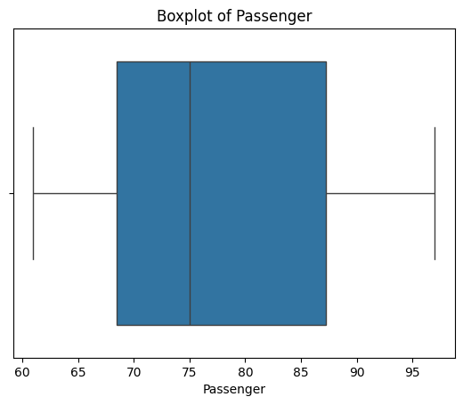
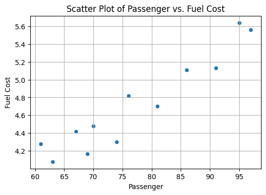
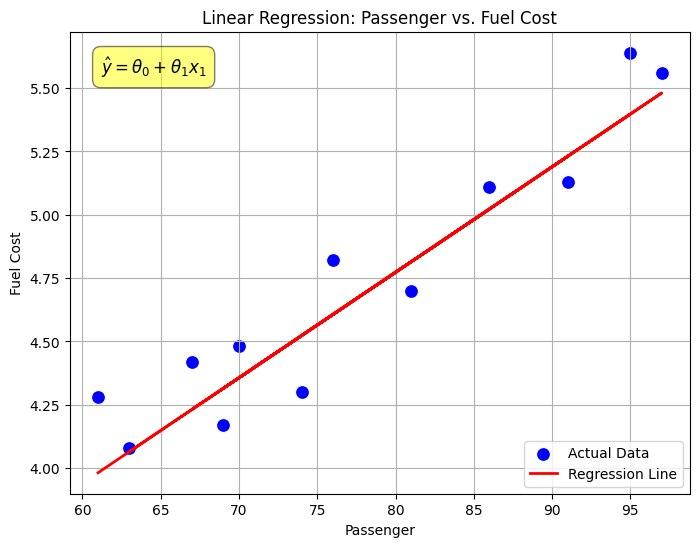
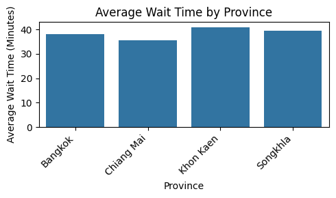
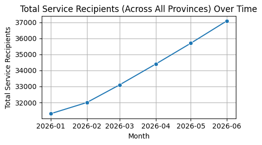
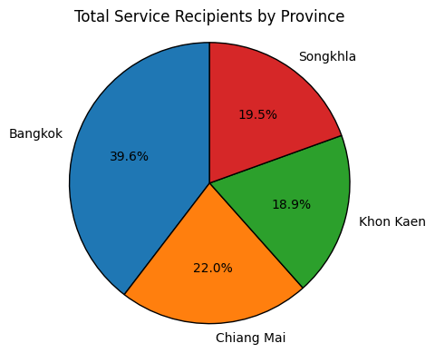
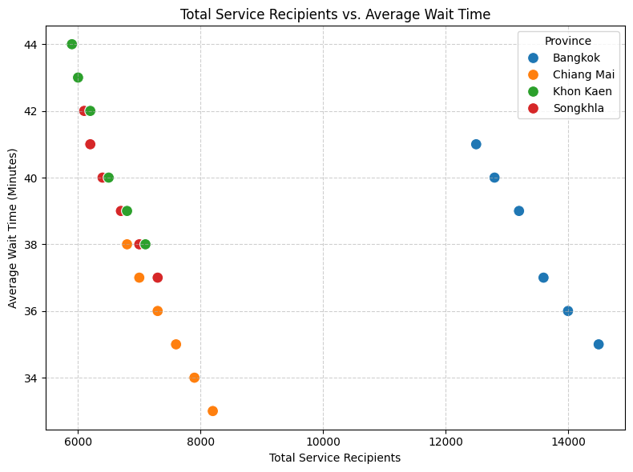
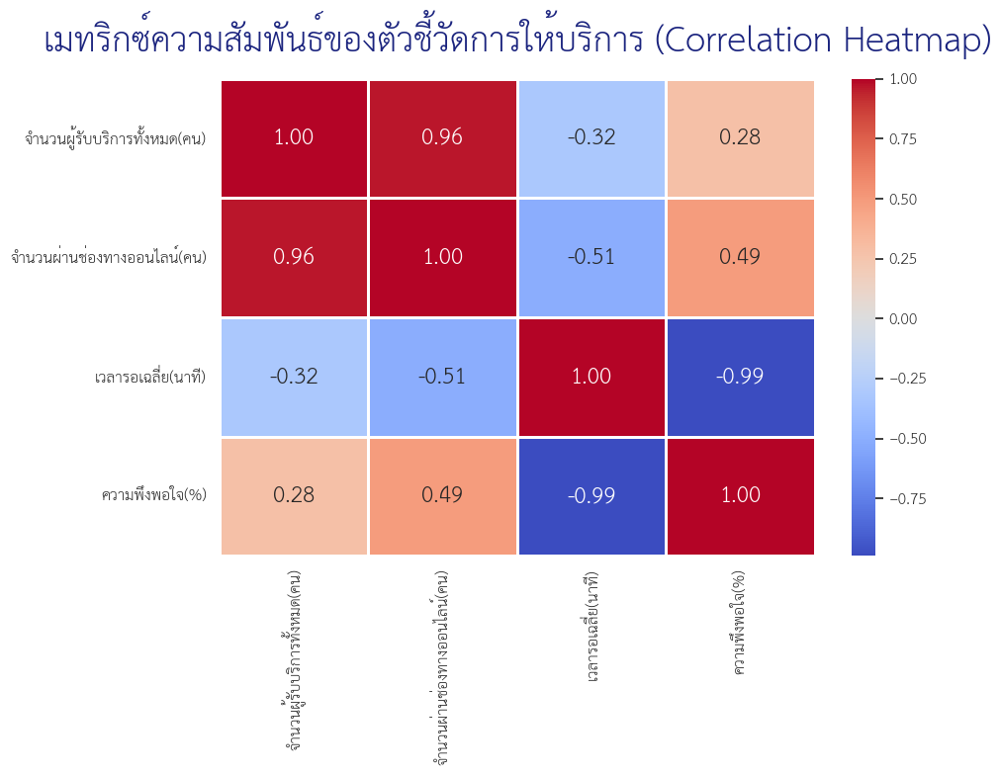
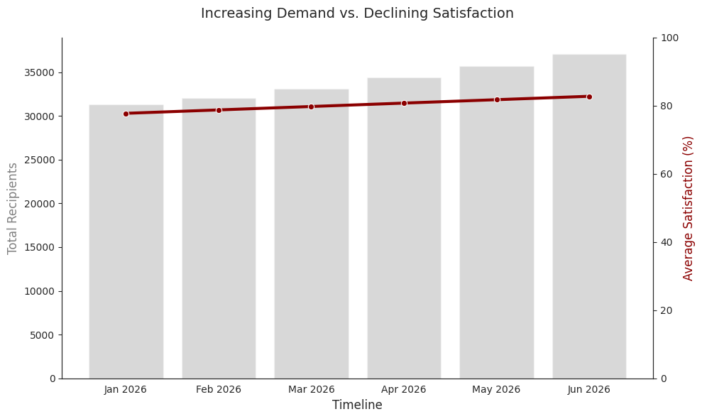

<!-- _class: lead -->

<style scoped>
.logo-bar { position: absolute; top: 36px; right: 64px; display: flex; align-items: center; gap: 16px; }
.logo-bar img { width: 100px; height: 100px; object-fit: contain; }
</style>

<div class="logo-bar">
  
  
</div>

# Session 03

# Data Visualization with Gemini in Colab


Stat on Campus: Data innovators 
Turning data into impact for public sector

Taweesak Samanchuen, Ph.D.
Mahidol University


---

## วัตถุประสงค์ของ Session

เมื่อจบช่วงนี้ ผู้เข้าอบรมสามารถ:

1. เลือกประเภทกราฟให้เหมาะกับชนิดข้อมูลและเป้าหมาย
2. ใช้ Gemini in Colab ช่วยออกแบบและสร้างกราฟได้รวดเร็วขึ้น
3. อธิบายความสัมพันธ์ของตัวแปรด้วย correlation และ regression เบื้องต้น
4. ตีความผลจากกราฟอย่างถูกต้องและชัดเจน
5. สื่อสารข้อมูลให้ผู้บริหารและผู้เกี่ยวข้องเข้าใจได้ง่าย

---

## ภาพรวมเนื้อหา

1. Recall: สิ่งที่เรียนไปแล้วใน Session 01-02
2. Univariate และ Bivariate Analysis
3. Correlation และ Regression
4. หลักการเลือกประเภทกราฟ
5. แนวคิดการสื่อสารข้อมูลด้วย Visualization
6. การใช้ AI ช่วยสร้างกราฟจากข้อมูล
7. การตีความและเล่าเรื่องจากกราฟ
8. Workshop 3

---
<!-- _class: lead -->
# 1. Recall

---
## 1) Recall 

- AI and ML
- Colab with AI 
- Basic Python for Data Analysis
- Data Preprocessing
- EDA 


---
<!-- _class: lead -->
# 2. Univariate และ Bivariate Analysis

---
## Univariate Analysis

### การวิเคราะห์ตัวแปรเดี่ยว

- วิเคราะห์ตัวแปรทีละตัว โดยไม่คำนึงถึงความสัมพันธ์กับตัวแปรอื่น
- เป้าหมาย: ทำความเข้าใจการกระจาย (distribution), ค่ากลาง, และ outlier
- กราฟที่ใช้: Histogram, Boxplot, Bar chart

| สถิติ | ความหมาย |
|---|---|
| Mean / Median | ค่ากลางของข้อมูล |
| Std Dev | ความผันแปรของข้อมูล |
| Min / Max | ขอบเขตของข้อมูล |

---
## ตัวอย่าง Univariate Analysis

```python
import pandas as pd
import matplotlib.pyplot as plt
import seaborn as sns
url = "https://github.com/toche7/DataSets/raw/refs/heads/main/cost.xlsx"
df = pd.read_excel(url)
# สถิติพื้นฐาน
print(df.describe())
# Histogram
sns.histplot(df["Passenger"], bins=6, kde=True)
plt.title("Number of Passenger")
plt.show()
```

---
## Univariate Analysis: Histogram
<div class="center">

</div>

---
## Univariate Analysis: Boxplot

<div class="columns">
<div>
- Boxplot แสดงค่ากลาง (median), quartiles, และ outliers ของข้อมูล
- ช่วยให้เห็นการกระจายและความไม่สมมาตรของข้อมูล

```python
sns.boxplot(data=df, x="Passenger")
plt.title("Boxplot of Passenger")
plt.show()
```

</div>
<div> 
  
</div>
</div>

---
## Bivariate Analysis

### การวิเคราะห์ความสัมพันธ์ระหว่าง 2 ตัวแปร

- วิเคราะห์ว่าตัวแปร 2 ตัวมีความสัมพันธ์กันอย่างไร
- เป้าหมาย: หารูปแบบ (pattern) และแนวโน้มร่วมกัน
- กราฟที่ใช้: Scatter plot, Box plot แยกกลุ่ม, Heatmap

| ชนิดข้อมูล | วิธีวิเคราะห์ |
|---|---|
| Numeric + Numeric | Scatter plot, Correlation |
| Numeric + Categorical | Boxplot, Grouped Bar chart |
| Categorical + Categorical | Crosstab, Heatmap |

---
## ตัวอย่าง Bivariate Analysis

<div class="columns">
<div>

```python
# Scatter plot: Passenger vs Fuel Cost
sns.scatterplot(data=df, x="Passenger", y="Fuel Cost")
plt.title("Passenger vs Fuel Cost")
plt.show()

# Correlation matrix
print(df[["Passenger", "Fuel Cost"]].corr())
```
</div>
<div>
  
</div>
</div>

---
<!-- _class: lead -->
# 3. Correlation และ Regression

---
## Correlation

<div class="columns">
<div>

-	Correlation (สหสัมพันธ์) เป็นการวิเคราะห์ความสัมพันธ์ระหว่างข้อมูลตั้งแต่ 2 ตัวขึ้นไปว่ามี
ความสัมพันธ์กันในระดับใด และมีความสัมพันธ์ในทิศทางใด
-	เช่น ความสูงกับน้ำหนักของคน มีความสัมพันธ์กันมากหรือน้อยและมีความสัมพันธ์ในทิศทางเดียวกัน หรือตรงกันข้าม
</div>
<div>
  
</div>
</div>

---
## Correlation Coefficient

- Correlation Coefficient คือค่าสถิติอย่างง่ายที่ใช้แสดงว่าความสัมพันธ์ระหว่างข้อมูล ว่ามีค่ามาก น้อยเพียงใดและอยู่ในทิศทางใด
- โดยมีสูตรพื้นฐานที่ใช้กันคือ Pearson Product Moment Correlation Coefficient
$$
r = \frac{cov(X, Y)}{ (std(X) * std(Y))} \tag{1}
$$

$$
r = \frac{\sum (X_i - \bar{X})(Y_i - \bar{Y})}{\sqrt{\sum (X_i - \bar{X})^2 \sum (Y_i - \bar{Y})^2}} \tag{2}
$$

>จะใช้ pearson correlation เมื่อข้อมูลเป็น continuous และมีความสัมพันธ์เชิงเส้น ถ้าเป็น categorical จะใช้ spearman correlation หรือ chi-square test แทน


---
## Correlation Coefficient Interpretation
- ค่า `r` ใกล้ `1` = ไปทิศทางเดียวกัน
- ค่า `r` ใกล้ `-1` = สวนทางกัน
- ค่า `r` ใกล้ `0` = ความสัมพันธ์เชิงเส้นน้อย


---
## ตัวอย่างการคำนวณ Correlation ด้วย Python

```python
import pandas as pd
url = "https://github.com/toche7/DataSets/raw/refs/heads/main/cost.xlsx"
df = pd.read_excel(url)
correlation = df["Passenger"].corr(df["Fuel Cost"])
print(f"Correlation between Passenger and Fuel Cost: {correlation:.2f}")
```


---

## Regression


<div class="columns">
<div>

### ใช้สร้างสมการทำนาย
$$
\hat{y} = \theta_0 + \theta_1 \cdot x_1
$$

- $\theta_1$ บอกว่า $\hat{y}$ (Fuel Cost) เปลี่ยนเท่าไรเมื่อ $x_1$ (Passenger) เพิ่ม 1 หน่วย
- ใช้สื่อสารแนวโน้มและประมาณค่าได้อย่างรวดเร็ว
- ควรตรวจ outlier และ residual ก่อนนำไปใช้จริง

</div>
<div>
  
</div>
</div>

---

## ตัวอย่างโค้ด

```python
import pandas as pd
import seaborn as sns
import matplotlib.pyplot as plt
from sklearn.linear_model import LinearRegression
url = "https://github.com/toche7/DataSets/raw/refs/heads/main/cost.xlsx"
df = pd.read_excel(url)
X = df[["Passenger"]]
y = df["Fuel Cost"]
model = LinearRegression().fit(X, y)
sns.regplot(data=df, x="Passenger", y="Fuel Cost", line_kws={"color": "red"}, ci=98)
plt.title(f"Passenger vs Fuel Cost ( R²={model.score(X, y):.2f})")
plt.show()
```


---

## Prompt ที่แนะนำ

```prompt
ใช้ไฟล์ cost.xlsx จาก GitHub นี้
1) โหลดข้อมูลด้วย pandas
2) สร้าง scatter plot และ regression line
3) คำนวณ correlation ระหว่าง Passenger กับ Fuel Cost
4) อธิบายผลเป็นภาษาไทยแบบที่ใช้สอนผู้เรียนได้
```

### จุดที่ให้ผู้เรียนสังเกต

- เมื่อ Passenger เพิ่มขึ้น Fuel Cost เปลี่ยนอย่างไร
- เส้น regression อธิบายข้อมูลได้ดีแค่ไหน
- ความสัมพันธ์ที่เห็นเป็นเหตุผลหรือเพียงความสัมพันธ์


---
<!-- _class: lead -->
# 4. Visualization เพื่อการสื่อสาร

---

## แพลตฟอร์มที่ใช้ในชั้นเรียน

1. Gemini in Colab: ช่วยคิด วิเคราะห์ และเขียนโค้ดในโน้ตบุ๊กเดียว
2. GitHub Raw CSV: ใช้เป็นแหล่งข้อมูลกลางให้ทุกคนโหลดข้อมูลชุดเดียวกัน
3. Visualization Libraries: ใช้ `pandas`, `matplotlib`, `seaborn`

---

## 1) หลักการเลือกประเภทกราฟ

### คำถามก่อนเลือกกราฟ

- ต้องการเปรียบเทียบ, แสดงแนวโน้ม, หรือแสดงสัดส่วน?
- ข้อมูลเป็นหมวดหมู่, ตัวเลขต่อเนื่อง, หรือเวลา?
- ผู้ชมต้องการตัดสินใจเรื่องใดจากกราฟนี้?

### แนวทางใช้งาน

- Bar chart: เปรียบเทียบค่าระหว่างกลุ่ม
- Line chart: แนวโน้มตามเวลา
- Scatter plot: ความสัมพันธ์ระหว่างตัวแปร
- Heatmap: รูปแบบ/ความเข้มข้นในหลายมิติ

---
## Bar chart: เปรียบเทียบค่าระหว่างกลุ่ม

<div class="center">
  
</div>

---
## Line chart: แนวโน้มตามเวลา

<div class="center">
  
</div>

---
## Pie chart: แสดงสัดส่วนของแต่ละกลุ่มในภาพรวม

<div class="center">
    
</div>


---
## Scatter plot: ความสัมพันธ์ระหว่างตัวแปร

<div class="center">
    
</div>

---
## Heatmap: รูปแบบ/ความเข้มข้นในหลายมิติ

<div class="center">
    
</div>

---

## ตัวอย่าง: คำถามแบบไหน ใช้กราฟอะไร

### ใช้ชุดข้อมูลผู้รับบริการภาครัฐรายเดือน

| คำถาม | กราฟที่เหมาะ | สิ่งที่อยากเห็น |
|---|---|---|
| จังหวัดไหนมีผู้รับบริการมากที่สุดในเดือนล่าสุด | Bar chart | เปรียบเทียบขนาดระหว่างจังหวัด |
| จำนวนผู้รับบริการเพิ่มหรือลดลงอย่างไรใน 6 เดือน | Line chart | แนวโน้มและจังหวะการเปลี่ยนแปลง |
| เวลารอที่ลดลง ทำให้ความพึงพอใจสูงขึ้นหรือไม่ | Scatter plot | ความสัมพันธ์ระหว่าง 2 ตัวแปร |
| จังหวัดใดมีจำนวนผู้รับบริการสูงต่อเนื่องหลายเดือน | Heatmap | จุดที่เข้ม/อ่อนในหลายมิติ |

---

## ตัวอย่างการตีความจากข้อมูลเดียวกัน

### ตัวอย่างข้อความสรุปที่ “ดีพอสำหรับนำเสนอ”

- Bar chart: กรุงเทพมหานครมีผู้รับบริการสูงสุดในเดือนล่าสุด จึงอาจต้องจัดทรัพยากรหน้าจุดบริการมากกว่าจังหวัดอื่น
- Line chart: ทุกจังหวัดมีแนวโน้มผู้รับบริการเพิ่มขึ้นต่อเนื่อง สะท้อนว่าความต้องการบริการยังขยายตัว
- Scatter plot: เมื่อเวลารอลดลง ความพึงพอใจมีแนวโน้มสูงขึ้น แต่ยังไม่พอจะสรุปว่าเป็นเหตุโดยตรง
- Heatmap: เชียงใหม่และกรุงเทพมหานครมีความเข้มสูงหลายเดือนต่อเนื่อง จึงควรติดตามกำลังคนและช่องทางออนไลน์ควบคู่กัน

### สิ่งที่ต้องระวัง

- อย่าสรุปว่า “เวลารอลดลงทำให้ความพึงพอใจสูงขึ้นแน่นอน” โดยไม่มีปัจจัยอื่นประกอบ
- อย่าดูเฉพาะจังหวัดที่ค่าสูงสุด แต่ให้ดูอัตราการเปลี่ยนแปลงและบริบทของพื้นที่ด้วย

---

## 2) Data Visualization เพื่อการสื่อสาร

### หลักการสำคัญ

- ชัดเจน: ลดองค์ประกอบที่ไม่จำเป็น
- ถูกต้อง: ไม่บิดเบือนสเกลหรือบริบท
- มีสาร: ทุกกราฟต้องตอบคำถามหลักได้

### โครงสร้างการเล่าเรื่องข้อมูล

1. บริบทของปัญหา
2. หลักฐานจากข้อมูล
3. Insight และข้อเสนอแนะ

---
## กรณีศึกษาประสิทธิภาพการบริการ

### 1. บริบทของปัญหา (Context)

เราต้องการตรวจสอบว่า 'จำนวนผู้รับบริการที่เพิ่มขึ้น ส่งผลกระทบต่อคุณภาพการบริการและความพึงพอใจหรือไม่' เพื่อวางแผนการจัดการทรัพยากรในอนาคต

### 2. หลักฐานจากข้อมูล (Evidence)

ใช้กราฟที่เน้นความ ชัดเจน โดยลด Grid lines ที่ไม่จำเป็น และเน้นความ ถูกต้อง ของสเกล


---
## Case Study: การสื่อสารข้อมูลด้วย Visualization

<div class="center">
    
</div>

---

## 3) ใช้ Gemini in Colab ช่วยสร้างกราฟ

### ตัวอย่างการใช้งาน

- ช่วยร่างโค้ดสร้างกราฟจากตารางข้อมูล
- แนะนำกราฟที่เหมาะกับตัวแปรแต่ละชุด
- ช่วยปรับแต่ง label/title/annotation ให้ชัดเจน
- สร้างสรุปข้อความประกอบกราฟอัตโนมัติ


---
## Prompt ที่แนะนำ

### Prompt ที่แนะนำ

```prompt
จากข้อมูลนี้ ช่วยเสนอ 3 กราฟที่เหมาะสม พร้อมเหตุผล และตัวอย่างโค้ด
```
### Prompt ตัวอย่างที่ชัดขึ้น

```prompt
ข้อมูลนี้เป็นจำนวนผู้รับบริการภาครัฐรายเดือน แยกตามจังหวัด
ช่วยเลือกกราฟที่เหมาะ 4 แบบ โดยอธิบายว่ากราฟแต่ละแบบตอบคำถามผู้บริหารอะไรได้
และเขียนโค้ด Python ที่พร้อมรันใน Colab"
```

---

## 4) การตีความกราฟอย่างมีคุณภาพ

### เช็กลิสต์ก่อนสรุปผล

- ความแตกต่างที่เห็นมีนัยสำคัญเชิงปฏิบัติหรือไม่
- มีปัจจัยแทรกซ้อนที่ยังไม่ถูกควบคุมหรือไม่
- ข้อสรุปสอดคล้องกับนิยามตัวชี้วัดหรือไม่
- มีข้อจำกัดข้อมูลที่ต้องแจ้งหรือไม่

### ข้อผิดพลาดที่พบบ่อย

- สรุปเหตุ-ผลจากความสัมพันธ์เพียงอย่างเดียว
- ใช้กราฟ 3D หรือเอฟเฟกต์ที่ทำให้ตีความคลาดเคลื่อน


---

## Workshop 6

[](https://colab.research.google.com/github/toche7/SlideAIDATADGA/blob/main/slides/workshop-06-data-visualization.ipynb)

### กิจกรรมฝึกปฏิบัติ

1. เลือกคำถามวิเคราะห์จาก Session 02
2. ออกแบบกราฟอย่างน้อย 3 แบบ
3. ใช้ Gemini in Colab ช่วยสร้าง/ปรับโค้ด
4. สรุปข้อความ insight ต่อกราฟละ 1-2 ประโยค

### ผลลัพธ์ที่คาดหวัง

- ชุดกราฟที่พร้อมนำเสนอ
- ข้อความอธิบายที่กระชับและใช้งานได้จริง

---
## ติดตั้ง font ภาษาไทยใน Colab

### Prompt
```prompt
ช่วยเขียนโค้ด Python ใน Colab เพื่อดาวน์โหลดและติดตั้งฟอนต์ภาษาไทยที่เหมาะกับการสร้างกราฟใน Matplotlib 
และทดสอบการแสดงผลด้วยข้อความภาษาไทย
```

- เลือก model ที่มีเก่งในการทำเรื่องนี้เพราะมีความซับซ้อนในการจัดการฟอนต์และการแสดงผลภาษาไทยในกราฟ ซึ่งอาจต้องใช้ความรู้เฉพาะทางในการตั้งค่าฟอนต์ใน Matplotlib และการจัดการกับภาษาไทยใน Python โดยตรง

- ให้เลือกฟอนต์ที่นิยมใช้สำหรับการนำเสนอในภาษาไทย เช่น "TH Sarabun New" หรือ "Kanit" และช่วยเขียนโค้ดที่พร้อมรันได้เลยใน Colab เพื่อให้ผู้เรียนสามารถใช้ฟอนต์นี้ในการสร้างกราฟและแสดงผลภาษาไทยได้อย่างถูกต้อง


---
## ติดตั้ง font ภาษาไทยใน Colab

```python
# ดาวน์โหลดฟอนต์ TH Sarabun New
!wget -q https://github.com/Phonbopit/sarabun-webfont/raw/master\
/fonts/thsarabunnew-webfont.ttf
import matplotlib as mpl
import matplotlib.pyplot as plt
import matplotlib.font_manager as fm

# เพิ่มฟอนต์เข้าระบบ Matplotlib
fm.fontManager.addfont('thsarabunnew-webfont.ttf')
# ตั้งค่า default font ให้เป็น TH Sarabun New
mpl.rc('font', family='TH Sarabun New')
```
---
## ทดสอบการแสดงผลภาษาไทย 

```python
# ทดสอบการพล็อตภาษาไทย
plt.figure(figsize=(6, 4))
plt.text(0.5, 0.5, 'สวัสดีภาษาไทย (Thai Language Test)', fontsize=25, ha='center', va='center')
plt.title('ทดสอบการแสดงผลภาษาไทย')
plt.axis('off')
plt.show()
```
---
## ผลลัพธ์ที่คาดหวัง

<div class="center">
    
</div>

---
## Workshop 6: โหลดข้อมูลจาก GitHub


### Dataset สำหรับฝึก

- Raw CSV: `https://raw.githubusercontent.com/toche7/DataSets/main/session-03-workshop-sample-data.csv`
- แพลตฟอร์มหลัก: Gemini in Colab
- เครื่องมือ: `pandas`, `matplotlib`, `seaborn`
- ใช้ชุดข้อมูลเดียวกันเพื่อสาธิตกราฟ 4 ประเภท

### Prompt ที่ให้ผู้เรียนใช้

```prompt
โหลดข้อมูลจากไฟล์ CSV นี้ และช่วยสร้างกราฟ 4 ประเภท ได้แก่ bar chart, line chart, scatter plot 
และ heatmap แยก เป็นภาพ ๆ พร้อมอธิบายว่าแต่ละกราฟตอบคำถามเชิงนโยบายอะไรได้บ้าง และช่วยปรับชื่อกราฟ 
แกน และสีให้เหมาะกับการนำเสนอผู้บริหาร:
```

---
## python code ตัวอย่างการโหลดข้อมูลและเริ่มต้นวิเคราะห์
```python
import pandas as pd
import matplotlib.pyplot as plt
import seaborn as sns
url = "https://raw.githubusercontent.com/toche7/DataSets/main/session-03-workshop-sample-data.csv"
df = pd.read_csv(url)
df["เดือน"] = pd.to_datetime(df["เดือน"])
sns.set_theme(style="whitegrid")
df.head()
```

---

## ตัวอย่าง 1-2: Bar และ Line

### Bar chart: เปรียบเทียบจังหวัดในเดือนล่าสุด

```python
latest = df[df["เดือน"] == df["เดือน"].max()]
sns.barplot(data=latest, x="จังหวัด", y="จำนวนผู้รับบริการทั้งหมด(คน)")
plt.xticks(rotation=15)
plt.title("จำนวนผู้รับบริการทั้งหมด แยกตามจังหวัด")
plt.show()
```

### Line chart: แนวโน้มรายเดือนของผู้รับบริการ

```python
sns.lineplot(data=df, x="เดือน", y="จำนวนผู้รับบริการทั้งหมด(คน)", hue="จังหวัด", marker="o")
plt.title("แนวโน้มผู้รับบริการรายเดือน")
plt.show()
```

---

## ตัวอย่าง 3-4: Scatter และ Heatmap

### Scatter plot: เวลารอกับความพึงพอใจ

```python
sns.scatterplot(data=df, x="เวลารอเฉลี่ย(นาที)", y="ความพึงพอใจ(%)", hue="จังหวัด", s=120)
plt.title("ความสัมพันธ์ระหว่างเวลารอและความพึงพอใจ")
plt.show()
```

### Heatmap: ผู้รับบริการตามเดือนและจังหวัด

```python
pivot = df.pivot(index="จังหวัด", columns="เดือน", values="จำนวนผู้รับบริการทั้งหมด(คน)")
sns.heatmap(pivot, cmap="YlGnBu", annot=True, fmt=".0f")
plt.title("Heatmap จำนวนผู้รับบริการ")
plt.show()
```

---

## Prompt ให้ Gemini ช่วยต่อยอด

```prompt
> ใช้ Gemini in Colab กับข้อมูลจากไฟล์ CSV นี้เพื่อสร้าง bar chart, line chart, scatter plot 
และ heatmap พร้อมอธิบายว่าแต่ละกราฟตอบคำถามเชิงนโยบายอะไรได้บ้าง และช่วยปรับชื่อกราฟ แกน 
และสีให้เหมาะกับการนำเสนอผู้บริหาร
```

### จุดที่ให้ผู้เรียนสังเกต

- จังหวัดใดมีปริมาณผู้รับบริการสูงสุดอย่างสม่ำเสมอ
- เวลารอที่ลดลงสัมพันธ์กับความพึงพอใจหรือไม่
- จังหวัดใดมีโอกาสเพิ่มสัดส่วนบริการออนไลน์ได้อีก

---

## สรุป Session 03

- กราฟที่ดีต้องตอบคำถามเชิงนโยบายได้
- AI ช่วยเร่งขั้นตอน แต่การตีความยังต้องอาศัยผู้เชี่ยวชาญ
- Visualization คือสะพานจากข้อมูลสู่การตัดสินใจ

---

<!-- _class: lead -->

# Q&A

เตรียมต่อ Session 04: AI-Assisted Reporting and Presentation


---

## วิทยากร


**ผศ.ดร.ทวีศักดิ์ สมานชื่น**
*Asst. Prof. Taweesak Samanchuen, Ph.D.*

- รองผู้อำนวยการฝ่ายดิจิทัลเทคโนโลยี **MULKC**
- อาจารย์ประจำสาขา **ITM** คณะวิศวกรรมศาสตร์ มหาวิทยาลัยมหิดล
- หัวหน้าโครงการ **CBTU** 

🔗 [Profile](https://itm.eg.mahidol.ac.th/personnel/taweesak-samanchuen/)  
📧 t.samanchuen@gmail.com
☎ 081-441-4906

websit: [cbtumu.net](https://cbtumu.net) | facebook: [cbtumu](https://www.facebook.com/CBTUMU/)


---

<!-- _class: lead -->

# ขอบคุณครับ

**ผศ.ดร.ทวีศักดิ์ สมานชื่น**
