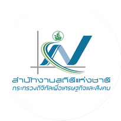

<!-- _class: lead -->

  
  

# Session 04

# Project: Data EDA and Visualization with Gemini in Colab

Stat on Campus: Data innovators 
Turning data into impact for public sector

Taweesak Samanchuen, Ph.D.
Mahidol University

---
## วัตถุประสงค์ของ Session
เมื่อจบช่วงนี้ ผู้เข้าอบรมสามารถ:
1. สร้าง EDA Pipeline ที่มี workflow ชัดเจน
2. สรุป Insight ระดับต้นเพื่อใช้ต่อใน Session ถัดไป
3. สร้างกราฟที่เหมาะสมกับข้อมูลและเป้าหมายการวิเคราะห์
4. สื่อสารผลการวิเคราะห์ด้วย Visualization ให้ผู้บริหารและผู้เกี่ยวข้องเข้าใจได้ง่าย
5. ใช้ Gemini in Colab ช่วยคิด วิเคราะห์ และเขียนโค้ดในโน้ตบุ๊กเดียว

---

## Project Instructions

1. แบ่งกลุ่มกลุ่มละ 4-5 คน
2. ให้เลือกข้อมูลจาก ที่กำหนดให้ 
3. ตรวจสอบและทำความเข้าใจข้อมูลเบื้องต้น เช่น ชนิดข้อมูล, ขนาดข้อมูล, ความสมบูรณ์ของข้อมูล
4. ทำ Data Quality Check และปรับข้อมูล
5. ทำ EDA และสรุปข้อค้นพบเบื้องต้น
6. สร้างกราฟเพื่อสื่อสารข้อมูลและผลการวิเคราะห์
7. สรุป Insight ระดับต้นเพื่อใช้ต่อใน Session ถัดไป
8. นำเสนอผลการวิเคราะห์และกราฟในชั้นเรียนเพื่อรับ feedback และปรับปรุงต่อไป กลุ่มละ 10 นาที

---
##  DGA Open Data 

1. ข้อมูลทรัพยากร: นักศึกษาปัจจุบัน ปีการศึกษา 2568 ภาคการศึกษาที่ 2 จำแนกตาม จังหวัดที่ตั้งสถาบัน
https://data.go.th/dataset/univ_std_11_011?id=e6e2fad4-4018-4ac6-93eb-1370aeef8ed1 

2. ข้อมูลทรัพยากร: ร้อยละของสถานประกอบการที่ขายสินค้าหรือบริการ ทางอินเทอร์เน็ต  
https://data.go.th/dataset/0505_16_2055?id=54eccfad-d9c3-4370-97c2-d487ec7bc327 

3. อัตราการมีงานทำต่อประชากรวัยแรงงาน
https://data.go.th/dataset/0706_02_0011?id=585e5552-8ecf-445c-be16-a97140018169

4. ข้อมูลทรัพยากร : ข้อมูลผู้ป่วยโรคติดต่อที่สำคัญ ปี 2569
https://data.go.th/dataset/5_desease?id=b59f2279-ced4-4c41-8452-e1c2cf60b2f1

5. ข้อมูลทรัพยากร : ปริมาณและมูลค่าผลผลิตสัตว์น้ำจากการเพาะเลี้ยงกุ้งทะเล
https://data.go.th/dataset/dofd07_05_0101_04?id=437d3bf9-8cb9-479a-8fe0-b293f0e598ac 

---
## การแข่งขันและการให้คะแนน

- การแข่งขัน: กลุ่มที่มีการวิเคราะห์และนำเสนอได้ดีที่สุดจะได้รับรางวัล
- การให้คะแนน: คะแนนจะพิจารณาจากความชัดเจนของคำถามวิเคราะห์, ความถูกต้องของการวิเคราะห์, ความเหมาะสมของกราฟ, และความสามารถในการสื่อสารข้อมูลให้เข้าใจง่าย
- รางวัล: รางวัลสำหรับกลุ่มที่ชนะจะเป็นของที่ระลึกจาก NSO และ Mahidol University รวมถึงโอกาสในการนำเสนอผลงานในงานสัมมนาเกี่ยวกับข้อมูลในอนาคต

---
<!-- _class: lead -->
# Thank you for your attention! 

---

## วิทยากร

**ผศ.ดร.ทวีศักดิ์ สมานชื่น**
*Asst. Prof. Taweesak Samanchuen, Ph.D.*

- รองผู้อำนวยการฝ่ายดิจิทัลเทคโนโลยี **MULKC**
- อาจารย์ประจำสาขา **ITM** คณะวิศวกรรมศาสตร์ มหาวิทยาลัยมหิดล
- หัวหน้าโครงการ **CBTU** 

🔗 [Profile](https://itm.eg.mahidol.ac.th/personnel/taweesak-samanchuen/)  
📧 t.samanchuen@gmail.com
☎ 081-441-4906

websit: [cbtumu.net](https://cbtumu.net) | facebook: [cbtumu](https://www.facebook.com/CBTUMU/)

---

<!-- _class: lead -->

# ขอบคุณครับ

**ผศ.ดร.ทวีศักดิ์ สมานชื่น**
