<!-- _class: lead -->

<style scoped>
.logo-bar { position: absolute; top: 36px; right: 64px; display: flex; align-items: center; gap: 16px; }
.logo-bar img { width: 250px; height: 100px; object-fit: contain; }
</style>

<div class="logo-bar">
  
</div>

# Session 01
# Generative AI for Data Work


หลักสูตร: การใช้ Generative AI เพื่อการวิเคราะห์ข้อมูลสำหรับภาครัฐ

Asst. Prof. Taweesak Samanchuen, Ph.D.
Mahidol University

---
## วัตถุประสงค์การเรียนรู้
- เข้าใจความหมายของ **Generative AI และ LLM**
- เข้าใจหลักการทำงานของ **Prompt, Token และ Context Window**
- เข้าใจหลักการ **Prompt Engineering** และเทคนิคการปรับ Prompt ให้ได้ผล
- สามารถปรับ Prompt ให้เหมาะกับงานข้อมูลที่ทำอยู่จริง


---

<!-- _class: divider -->

## 01
## Generative AI and LLM

Using AI to Accelerate Data Work, Not Replace Thinking

---

## AI คืออะไร? (ฉบับ 2 นาที)

<div class="columns">
<div>   

### AI (Artificial Intelligence)
แบบจำลองสมองที่เรียนรู้จากข้อมูลมหาศาล

### Generative AI
AI ที่ **สร้างสิ่งใหม่** ได้ — ข้อความ ภาพ เสียง วิดีโอ

### LLM (Large Language Model)
เรียนรู้จาก pattern ของภาษามนุษย์

</div>
<div>

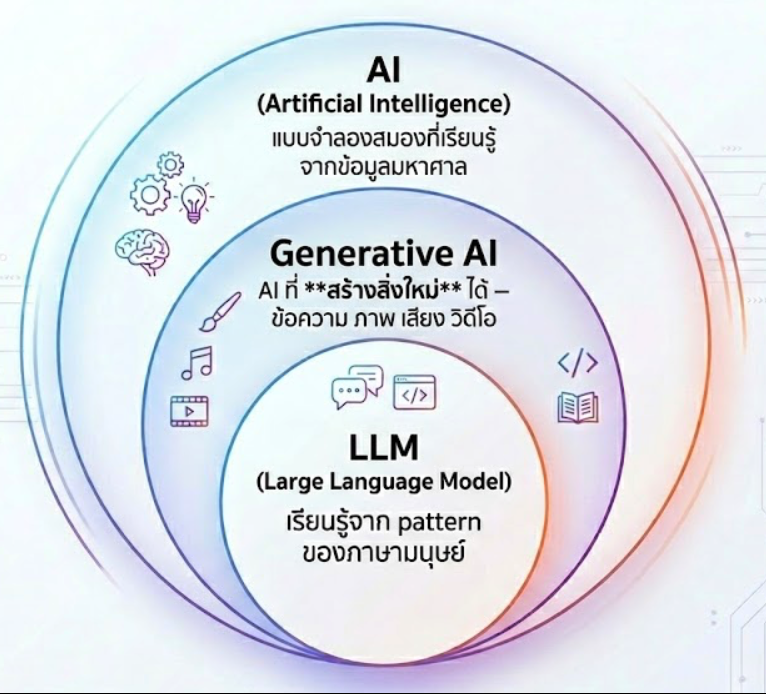

</div>
</div>

---

## Generative AI คืออะไร

### คำอธิบายแบบสั้นที่สุด

- เป็นกลุ่มของ AI ที่ **สร้างเนื้อหาใหม่** จาก pattern ที่เรียนรู้มา
- เนื้อหาที่สร้างได้อาจเป็น **ข้อความ, รูปภาพ, เสียง, โค้ด, วิดีโอ**
- คำว่า "generate" ไม่ได้แปลว่าคิดเองจากศูนย์ แต่คือสร้าง output ใหม่จากสิ่งที่เคยเรียนรู้

### ตัวอย่างที่พบได้บ่อย

- สร้างอีเมลหรือสรุปรายงาน
- สร้างรูปภาพจาก prompt
- สร้างโค้ด Python หรือ SQL
- สร้างข้อความจำลองสำหรับทดสอบระบบ

---

## ตัวอย่างการใช้งาน Generative AI ในปัจจุบัน

| สิ่งที่เห็น | จริง ๆ คืออะไร | ตัวอย่างงาน |
|---|---|---|
| ChatGPT, Claude, Gemini | ผู้ช่วยสนทนาที่ขับเคลื่อนด้วย LLM | ถามตอบ, สรุป, เขียน SQL |
| Llama, GPT, Qwen | ตระกูลของ LLM | generate text, classify, extract |
| Midjourney, DALL-E | Generative AI สำหรับภาพ | สร้างรูปจากข้อความ |
| Suno | Generative AI สำหรับเสียง/เพลง | สร้าง audio |

### บริบทของคาบนี้

- เราจะโฟกัส **text-based Generative AI**
- หรือพูดให้ตรงขึ้นคือ **การใช้ LLM กับงานข้อมูล**

---

## แล้ว LLM คืออะไร

### ความสัมพันธ์กับ Generative AI

- **LLM = Large Language Model**
- LLM เป็น **หนึ่งประเภทของ Generative AI** ที่เชี่ยวชาญเรื่องภาษา
- ถ้า Generative AI เป็น "หมวดใหญ่" LLM คือ "เครื่องมือย่อย" ที่ใช้สร้างและเข้าใจข้อความ

### เปรียบเทียบแบบง่าย

- **Generative AI**: คำรวมของระบบที่สร้าง content ใหม่
- **LLM**: โมเดลที่สร้างและประมวลผล "ภาษา" เป็นหลัก

> สรุปสั้น: ทุก LLM เป็น Generative AI แต่ไม่ใช่ทุก Generative AI จะเป็น LLM


---
## Modern Chat AI

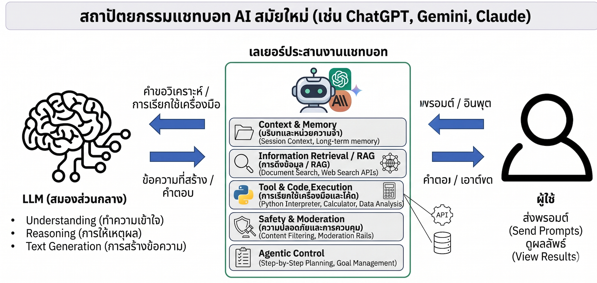

---

## Token คืออะไร?

> **Token** = หน่วยเล็กที่สุดที่ AI ใช้ "อ่าน" และ "เขียน" ข้อความ — ไม่ใช่คำ แต่เป็นชิ้นส่วนของคำ

<div class="columns">
<div>

### ตัวอย่าง (ภาษาอังกฤษ)
- "Hello" = 1 token
- "unbelievable" = 3 tokens
- 1 คำ ≈ 0.75 token โดยเฉลี่ย

</div>
<div>

### ตัวอย่าง (ภาษาไทย)
- ภาษาไทยใช้ token มากกว่า EN ~2-3x
- "สวัสดี" ≈ 3-5 tokens

</div>
</div>

---

## Token คืออะไร? (ต่อ)

### ทำไมต้องรู้?
- **Context Window** วัดเป็น token
- ยิ่ง Prompt ยาว → ใช้ token มาก → เหลือพื้นที่คำตอบน้อยลง
- บริการ API คิดเงินตาม token
  

> สำหรับคนทำงานทั่วไป: จำง่ายๆ ว่า <strong>1,000 token ≈ ข้อความ ¾ หน้า A4</strong>

สามารถทดสอบนับ token ได้ที่: [tiktokenizer.vercel.app](https://tiktokenizer.vercel.app)


---

## Context Window คืออะไร?

> **Context Window** = "ความจำระยะสั้น" ของ AI — ข้อมูลทั้งหมดที่ AI มองเห็นในการสนทนาครั้งนั้น
<div class="columns">
<div>

### ใส่ได้ทั้ง
- ข้อความบทสนทนาทั้งหมด
- เอกสารที่แนบ / วางข้อความ
- คำสั่งระบบ (System Prompt)

</div>
<div>

### Gemini 2.0 รองรับ
- **1 ล้าน token** (~750,000 คำ)
- ≈ หนังสือ 10 เล่ม หรือโค้ด 30,000 บรรทัด
- เกิน limit → AI "ลืม" ส่วนต้น

</div>
</div>

<div class="tip">
💡 ถ้าสนทนายาวมากแล้ว AI เริ่มตอบผิดพลาด — ลองเปิด chat ใหม่และสรุป context ก่อน
</div>


---

## LLM ช่วยงานข้อมูลอะไรได้บ้าง

### ใน workflow จริง

- แปลงคำถามธุรกิจเป็น **SQL**
- ช่วยอ่านผล **EDA** และตั้ง hypothesis
- ดึงข้อมูลจากข้อความด้วย **extraction**
- ตรวจความผิดปกติและช่วย reasoning เบื้องต้น
- สรุปผลเชิงเทคนิคให้เป็นภาษาที่สื่อสารกับทีมได้

> คำถามหลักของคาบ: ใช้ AI ตรงไหนแล้วคุ้ม แต่ยังควบคุมคุณภาพได้?

---

## ศัพท์สำคัญที่ต้องรู้ก่อนเริ่ม

### คำที่เจอบ่อยในคาบนี้

- **Prompt**: ข้อความคำสั่งที่เราใช้สื่อสารกับโมเดล
- **Context**: ข้อมูลประกอบที่ใส่เพิ่มให้โมเดลตอบดีขึ้น
- **Hallucination**: โมเดลตอบอย่างมั่นใจ แต่ข้อเท็จจริงผิด
- **Human verification**: มนุษย์เป็นผู้ตรวจคำตอบก่อนนำไปใช้จริง
- **Workflow**: ลำดับขั้นของงานตั้งแต่รับข้อมูลจนสื่อสารผล

### หลักจำง่าย

- prompt ที่ดี + context ที่พอ + การตรวจโดยคน = ใช้งานได้จริงมากขึ้น

---

## หลักคิดก่อนใช้ LLM

### AI เป็นผู้ช่วย ไม่ใช่ผู้ตัดสินสุดท้าย

- LLM เก่งเรื่อง pattern ของภาษา ไม่ได้ "รู้จริง" ทุกเรื่อง
- คำตอบที่ลื่นไหลอาจยัง **ผิดเชิงข้อเท็จจริง** ได้
- งาน data ต้องมี **human verification** เสมอ
- ยิ่ง prompt ชัด ยิ่งลดความคลุมเครือของ output

### สิ่งที่ต้องตรวจทุกครั้ง

- logic ถูกไหม
- data leakage หรือไม่
- ตัวเลขและ assumptions สอดคล้องโจทย์หรือไม่

---

## Hallucination คืออะไร

### อาการที่เจอได้บ่อย

- อ้างชื่อคอลัมน์ที่ไม่มีอยู่จริง
- เขียน SQL ที่ syntax ดูเหมือนถูก แต่รันไม่ได้
- สรุป insight ที่ไม่ได้รองรับจากข้อมูล
- อ้างเหตุผลเชิงธุรกิจเกินกว่าสิ่งที่ข้อมูลบอกได้

### วิธีรับมือ

- ให้ schema หรือข้อมูลต้นทางชัดเจน
- ขอให้โมเดลระบุ assumptions
- ตรวจผลด้วย code, query, หรือ domain knowledge จริง

---

## ตัวอย่างงานในคาบนี้: อะไรคือ Generative AI

### ตัวอย่างที่เราจะเห็นจริง

- ให้ LLM **สร้าง SQL** จากคำถามธุรกิจ
- ให้ LLM **สรุป EDA** จาก `describe()` และ missing values
- ให้ LLM **extract sentiment และ entities** จาก feedback
- ให้ LLM **ร่าง summary ภาษา business** จากผลวิเคราะห์

### จุดร่วมของทุกตัวอย่าง

- โมเดลรับ input เป็นข้อความหรือข้อมูลที่แปลงเป็นข้อความ
- โมเดลสร้าง output ใหม่ในรูปที่มนุษย์นำไปใช้ต่อได้
- แต่ผลลัพธ์ยังต้องผ่านการตรวจโดยผู้วิเคราะห์เสมอ
  


---

<!-- _class: divider -->

## 02
## Basic Prompt Engineering 

---

## Prompt คืออะไร?

**Prompt** = ประโยคที่คุณพิมพ์ให้ Gemini

> ผลลัพธ์ดีหรือแย่ — ขึ้นอยู่กับ **วิธีที่คุณถาม** เป็นหลัก

### สูตรพื้นฐาน
**บริบท + งาน + รูปแบบที่ต้องการ**

<div class="example">
"คุณคือผู้ช่วยฝ่าย HR (บริบท) — ช่วยเขียนอีเมลแจ้งนโยบาย WFH ใหม่ให้พนักงาน (งาน) — โทนสุภาพ ความยาว 2 ย่อหน้า (รูปแบบ)"
</div>

---

## ก่อน vs. หลัง ใส่ Prompt ที่ดี

| Prompt แย่ | Prompt ดี |
|-----------|-----------|
| "สรุปรายงานให้หน่อย" | "สรุปรายงานนี้เป็น 5 bullet points เน้น Action Items สำหรับผู้บริหาร" |
| "เขียนอีเมล" | "เขียนอีเมลทางการถึงลูกค้า เรื่องเลื่อนส่งงาน โทนขอโทษและมั่นใจ" |
| "แปลให้หน่อย" | "แปลข้อความนี้เป็นภาษาอังกฤษแบบ Business formal" |

---

## CO-STAR Framework คืออะไร?

> **[CO-STAR](https://www.tech.gov.sg/technews/mastering-the-art-of-prompt-engineering-with-empower/)** คือกรอบการเขียน Prompt ที่พัฒนาโดย **GovTech Singapore**
> เพื่อช่วยให้ได้คำตอบจาก AI ที่ **ตรงความต้องการและนำไปใช้งานได้ทันที**

<div class="columns">

<div>

### ปัญหาที่แก้
- Prompt คลุมเครือ → คำตอบไม่ตรงใจ
- AI เดาเจตนาผิด → ต้องถามซ้ำหลายรอบ
- ผลลัพธ์ไม่เหมาะกับผู้รับ

</div>
<div>

### วิธีที่แก้
- ใส่ข้อมูล **6 มิติ** ให้ AI เข้าใจงานครบถ้วน
- ลด back-and-forth → ประหยัดเวลา
- ผลลัพธ์พร้อมใช้ตั้งแต่ครั้งแรก

</div>
</div>

<div class="tip">
💡 ใช้งานได้กับทุก AI — Gemini, ChatGPT, Claude ฯลฯ
</div>

---

## สูตร CO-STAR Framework

| ตัวอักษร | ความหมาย | ตัวอย่าง |
|---------|----------|---------|
| **C**ontext | บริบทของงาน | "ฉันเป็น HR ในบริษัท 200 คน" |
| **O**bjective | เป้าหมายที่ต้องการ | "ช่วยเขียนอีเมลแจ้งนโยบาย WFH" |
| **S**tyle | รูปแบบการเขียน | "เขียนแบบ Business formal" |
| **T**one | โทนเสียง | "สุภาพ เป็นมิตร ไม่เป็นทางการเกินไป" |
| **A**udience | กลุ่มเป้าหมาย | "พนักงานทุกระดับ ไม่เชี่ยวชาญเทคนิค" |
| **R**esponse | รูปแบบผลลัพธ์ | "ตอบเป็นอีเมล ความยาว 2 ย่อหน้า" |

---

## หลักการใช้ CO-STAR ให้ได้ผล

- **ไม่ต้องครบทุกตัวทุกครั้ง** — งานง่ายใช้แค่ C + O + R ก็พอ
- **เรียง C → O ก่อนเสมอ** — AI ต้องรู้บริบทและเป้าหมายก่อนตอบ
- **A (Audience) สำคัญมาก** — "สำหรับผู้บริหาร" vs "สำหรับพนักงานใหม่" ให้ผลต่างกันมาก
- **T (Tone) ควบคุมน้ำเสียง** — เป็นทางการ / เป็นกันเอง / กระชับตรงประเด็น

<div class="tip">
💡 เริ่มจาก <strong>C + O + R</strong> ก่อน แล้วค่อยเพิ่ม S, T, A เมื่อผลลัพธ์ยังไม่ตรงที่ต้องการ
</div>

---

## CO-STAR ในงานจริง — ตัวอย่าง

<div class="example">

**[C]** ฉันเป็นเจ้าหน้าที่ฝ่ายประชาสัมพันธ์ของหน่วยงานราชการ<br>**[O]** ช่วยเขียนประกาศรับสมัครงานตำแหน่งนักวิเคราะห์นโยบาย<br>**[S]** เขียนแบบราชการ ถูกต้องตามรูปแบบ<br>**[T]** เป็นทางการ น่าเชื่อถือ<br>**[A]** ผู้สมัครที่จบปริญญาตรีขึ้นไป<br>**[R]** ตอบเป็นประกาศพร้อมใช้ ความยาว 1 หน้า A4

</div>

<div class="tip">
💡 ยิ่งให้ข้อมูลครบ — Gemini ยิ่งตอบตรงและนำไปใช้ได้ทันที
</div>

---

## เทคนิค: Chain of Thought

> ให้ AI "คิดทีละขั้น" ก่อนตอบ

<div class="example">
เพิ่มประโยคนี้ในทุก Prompt ที่ต้องการความแม่นยำ:<br><br>
<strong>"ลองคิดทีละขั้นตอน แล้วค่อยตอบ"</strong><br>
หรือ <strong>"Let's think step by step"</strong>
</div>

**เหมาะกับ**: การคำนวณ, การวิเคราะห์เหตุผล, การตัดสินใจซับซ้อน

---

## CoT ปี 2026 — ยังต้องพิมพ์เองไหม?

| Model | Reasoning อัตโนมัติ | ต้องสั่งเอง |
|-------|-------------------|------------|
| Gemini 2.0 Flash Thinking | ✅ คิดเองโดยไม่ต้องบอก | ไม่จำเป็น |
| Gemini 1.5 / GPT-4o | ⚠️ คิดได้บ้าง | แนะนำสั่ง |

<div class="tip">
💡 ถ้าใช้ <strong>Gemini 2.0+</strong> — เปิด "Thinking Mode" แทนการพิมพ์ "คิดทีละขั้น" ได้เลย
</div>

---

## ทำอะไรแทน CoT ได้บ้าง?

- **เปิด Thinking Mode** — Gemini 2.0 Flash Thinking มี reasoning built-in
- **แบ่งถามทีละ step** — ถาม "วิเคราะห์ปัญหาก่อน" → แล้วค่อย "เสนอแนวทาง"
- **ใช้ CO-STAR ให้ครบ** — O และ R ที่ชัดเจนช่วยให้ AI reasoning ดีขึ้นเอง

<div class="example">
แทนที่: "วิเคราะห์สัญญานี้ให้หน่อย"<br><br>
ใช้: <strong>"อ่านสัญญานี้ก่อน → แล้วบอกว่าข้อไหนเสี่ยง → พร้อมแนะนำว่าควรแก้อย่างไร"</strong>
</div>


---

## เทคนิค: Role Prompting

> กำหนด "บทบาท" ให้ AI ก่อนถาม

<div class="example">
"คุณคือ <strong>นักกฎหมายผู้เชี่ยวชาญด้านสัญญา</strong><br>
อ่านสัญญาต่อไปนี้และบอกจุดเสี่ยงที่ควรระวัง: [วางสัญญา]"
</div>

<div class="tip">
💡 Role ที่ดีช่วยให้ Gemini ใช้ "มุมมอง" ที่ถูกต้อง — ผลลัพธ์แม่นยำกว่ามาก
</div>


---

## Role Prompting — ตัวอย่างในงานออฟฟิศ

| Role ที่กำหนด | เหมาะกับงาน |
|--------------|------------|
| "คุณคือนักสื่อสารองค์กรมืออาชีพ" | เขียนประกาศ อีเมล จดหมาย |
| "คุณคือวิทยากรที่สอนคนไม่เชี่ยวชาญ" | อธิบายเรื่องยากให้เข้าใจง่าย |
| "คุณคือบรรณาธิการภาษาไทย" | ตรวจแก้ภาษา ปรับโทนเนื้อหา |
| "คุณคือผู้จัดการโครงการที่มีประสบการณ์" | วางแผน ระบุความเสี่ยง ติดตามงาน |

<div class="tip">
💡 เลือก Role ที่ <strong>ไม่ขึ้นกับกฎหมายหรือข้อบังคับเฉพาะประเทศ</strong> — ผลลัพธ์จะแม่นยำและเชื่อถือได้มากกว่า
</div>

---

## Chat Template Structure คืออะไร?

> ทุก Prompt ที่คุณส่ง จริงๆ แล้ว AI มองเห็นเป็น **3 ส่วน**

| ส่วน | คือ | ตัวอย่าง |
|-----|-----|---------|
| **System** | คำสั่งตั้งต้น / บุคลิก AI | "คุณคือผู้ช่วยที่ตอบภาษาไทยเท่านั้น" |
| **User** | สิ่งที่คุณพิมพ์ | Prompt ที่คุณส่งไป |
| **Assistant** | คำตอบของ AI | ข้อความที่ Gemini ตอบกลับ |

<div class="tip">
💡 Role Prompting ที่เราใส่ใน Prompt คือการ "จำลอง System" — นั่นคือเหตุผลที่มันส่งผลต่อโทนและมุมมองของคำตอบ
</div>

---

<div class="center">

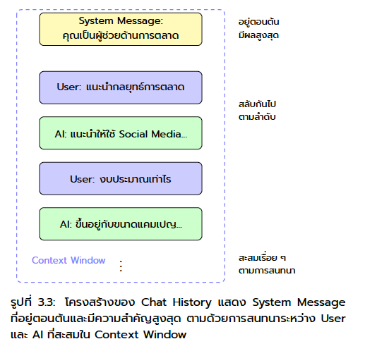

</div>


---

<div class="center">

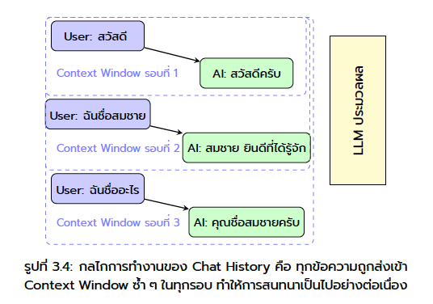

</div>

---

<div class="columns">   
<div>

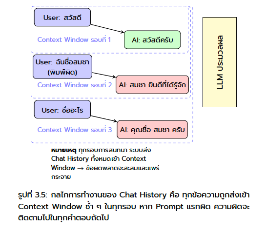

</div>
<div>

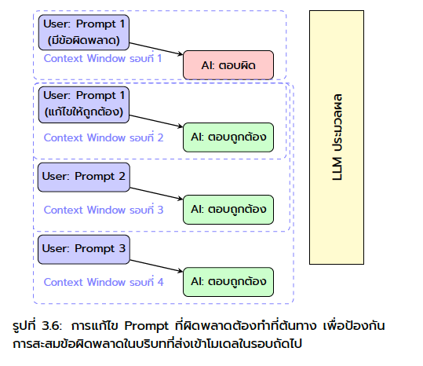

</div>
</div>

---

## Workshop 1 — Prompt ก่อน/หลัง

<div style="background:#e8f0fe; border-left:5px solid var(--gemini-blue); padding:16px 20px; border-radius:4px;">

**ลองทำ** (10 นาที)

1. เลือกงานที่ทำบ่อยในชีวิตประจำวัน
2. เขียน Prompt แบบสั้นๆ ก่อน → ดูผลลัพธ์
3. ปรับ Prompt ด้วยสูตร **CO-STAR** → เปรียบเทียบ

**คำถามชวนคิด**: ผลลัพธ์ต่างกันอย่างไร?
</div>

---
**ตัวอย่างเริ่มต้น:**
- Prompt สั้น: *"เขียนอีเมลขอเลื่อนนัดประชุม"*
- Prompt CO-STAR: *"[C] ฉันเป็นเจ้าหน้าที่ธุรการ [O] เขียนอีเมลขอเลื่อนนัดประชุมกับลูกค้า [S] ทางการ [T] สุภาพ ขอโทษอย่างจริงใจ [A] ลูกค้าระดับผู้บริหาร [R] อีเมล 1 ย่อหน้า"*


---

<!-- _class: divider -->

## 03
## Data Analysis with Gemini


---
## การวิเคราะห์ข้อมูลด้วย Gemini

- เราสามารถใช้ Gemini ช่วยวิเคราะห์ข้อมูลได้หลายรูปแบบ เช่น
  - วิเคราะห์แนวโน้มและความแตกต่างระหว่างกลุ่มประชากร
  - ตรวจสอบความผิดปกติของข้อมูล
  - สรุปผลเชิงสถิติและสร้างกราฟประกอบ
  - สร้างโค้ด SQL หรือ Python สำหรับการวิเคราะห์ต่อไป 
  - สรุปผลเชิงนโยบายจากข้อมูลที่วิเคราะห์แล้ว
- แต่ **ต้องมี Human Verification** ทุกครั้ง
- > Gemini ช่วย "คิดไว" แต่คนต้อง "คุมคุณภาพ"


---

## ภาพรวมกระบวนการวิเคราะห์ด้วย LLM/Gemini

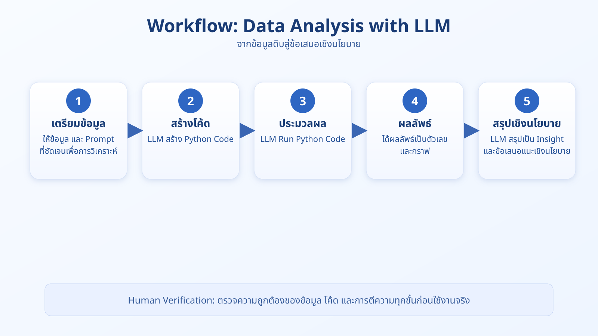


---
## Workshop 2 — การวิเคราะห์ข้อมูลขนาดเล็กด้วย Gemini


1. ดาวโหลดไฟล์ presidents.csv ที่
https://github.com/toche7/DataSets/blob/main/president_heights.csv
2. เปิดใช้งาน gemini.google.com
3. เปิด chat ใหม่และ add ไฟล์ president_heights.csv ที่ดาวน์โหลดจาก GitHub


4. พิมพ์ prompt เช่น
```prompt
ช่วยวิเคราะห์ข้อมูลความสูงของประธานาธิบดีในไฟล์นี้ และตอบคำถามต่อไปนี้: ความสูงเฉลี่ย ความสูงมากสุด 
และน้อยสุด พร้อมสร้างกราฟการกระจายความสูงด้วย
```


---
## ตัวอย่างผลลัพธ์ที่ได้จาก Gemini

<div class="center">

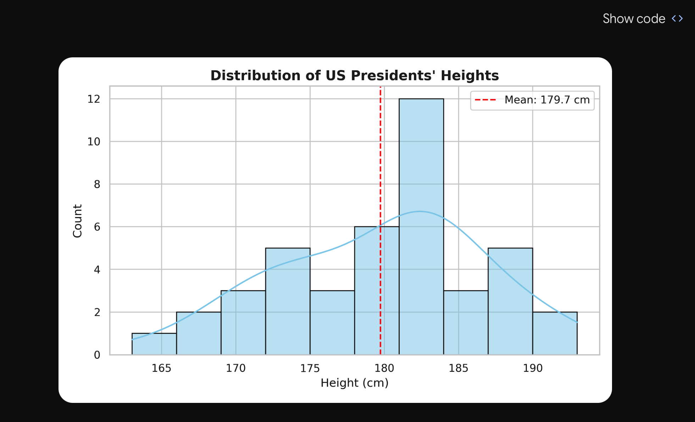

</div>


---
## Python Code ที่ Gemini สร้างให้

<div class="center">

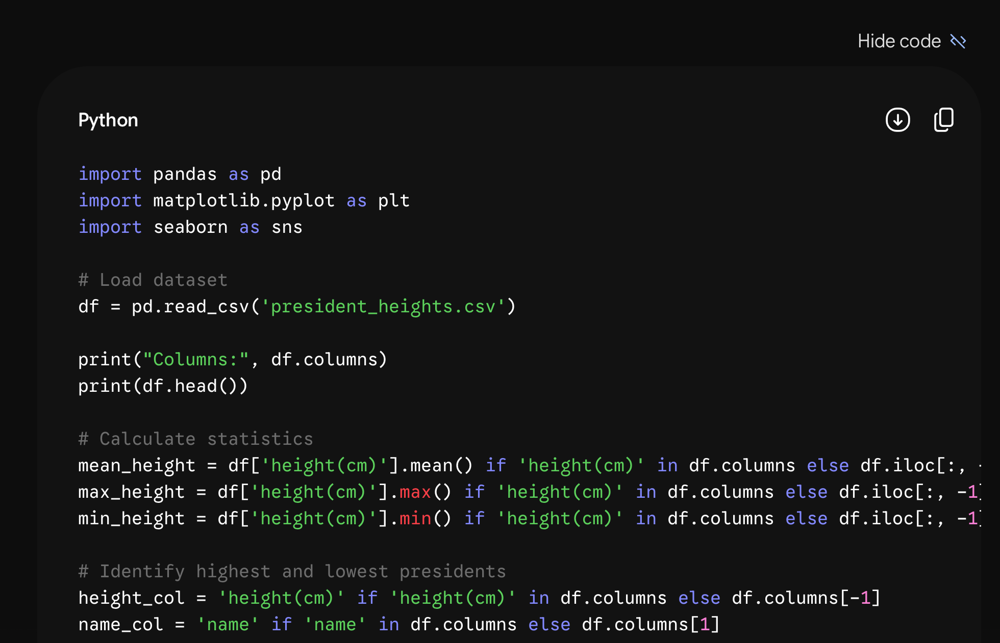

</div>


---
## การวิเคราะห์ข้อมูลขนาดใหญ่ด้วย Gemini

ในการวิเคราะห์ข้อมูลขนาดใหญ่ (เช่น ข้อมูลประชากร) เราสามารถใช้ Gemini ช่วยวิเคราะห์ได้ แต่ต้องระวังเรื่อง **Context Window** และ **Token Limit** ของโมเดล ความซ้ำซ้อนของข้อมูล และความถูกต้องของผลลัพธ์
ต้องมีการตรวจสอบโดยมนุษย์ (Human Verification) ทุกครั้ง และควรจะมี workflow ที่ชัดเจนในการวิเคราะห์ข้อมูล เช่น 
- การทำ Data Cleansing
- การตรวจสอบความถูกต้องของข้อมูล
- การสร้าง Prompt ที่เหมาะสม
- การสรุปผลเชิงนโยบายจากข้อมูลที่วิเคราะห์แล้ว

ในส่วนต่อไปนี้ เราจะใช้ตัวอย่างข้อมูลจริงจาก **อัตราการมีงานทำต่อประชากรวัยแรงงาน** ของสำนักงานสถิติแห่งชาติ (NSO) เพื่อฝึกการวิเคราะห์ข้อมูลด้วย Gemini

---
## Dataset: อัตราการมีงานทำต่อประชากรวัยแรงงาน (NSO)

- ชุดข้อมูล: [data.go.th - 0706_02_0011](https://data.go.th/dataset/0706_02_0011?id=585e5552-8ecf-445c-be16-a97140018169)
- หน่วย: **ร้อยละ**
- แหล่งข้อมูล: **สำรวจภาวะการทำงานของประชากร**
- ช่วงปีข้อมูล: **2558-2563**
- มิติที่มีให้จำแนก: **เพศ / กลุ่มอายุ / ระดับการศึกษา / อุตสาหกรรม**


---

## ตัวอย่างข้อมูลจริง (Raw Data)

<div class="center">

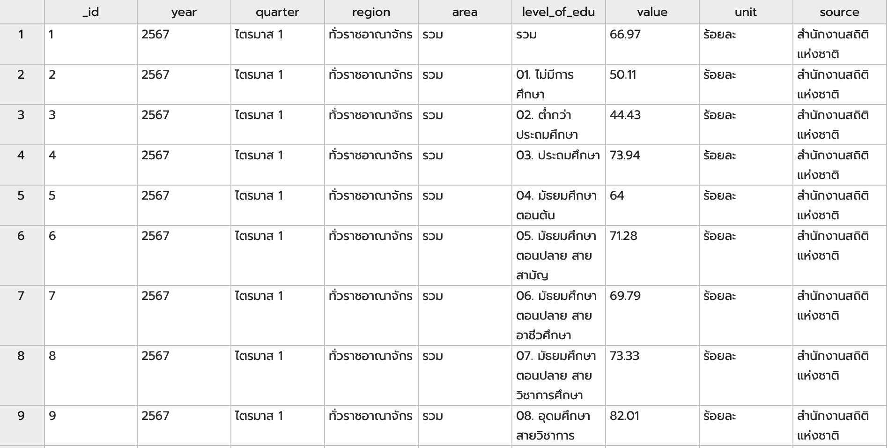

</div>

> ตัวอย่างคอลัมน์ที่ใช้ใน workshop: `year`, `quarter`, `region`, `area`, `level_of_edu`, `value`


---

## Workflow: Data Analysis with Gemini

1. **Define Policy Question**: ตั้งคำถามเชิงนโยบาย เช่น กลุ่มไหนเสี่ยงตกงาน
2. **Load NSO Table**: เลือกตารางจาก resource ที่ต้องการ (ภาพรวม/เพศ-อายุ/การศึกษา)
3. **Ask Structured Analysis**: ให้ Gemini สรุปแนวโน้ม, ความต่างรายกลุ่ม, จุดผิดปกติ
4. **Human Verify**: ตรวจตัวเลขจริงก่อนแปลผลเชิงนโยบาย

> หลักจำง่าย: Gemini ช่วย "คิดไว" แต่คนต้อง "คุมคุณภาพ"


---

## Prompt Template สำหรับโจทย์นี้

<div class="example">

**Context:** ฉันเป็นนักวิเคราะห์ข้อมูลภาครัฐด้านแรงงาน<br>

**Task:** วิเคราะห์แนวโน้มและความแตกต่างระหว่างกลุ่มประชากร<br>

**Output:** ตอบ 3 ส่วน: Insight | Evidence | Policy Recommendation<br>

### แนบไฟล์ CSV ที่ดาวโหลดจาก data.go.th (อัตราการมีงานทำต่อประชากรวัยแรงงาน) 

</div>


---
## ข้อควรระวังข้อมูลชุดนี้ 

- ควรทำการ cleansing แถวข้อมูลส่วนที่มี region "ทั่วราชอาญาจักร" หรือ “ทั่วประเทศ”, area “รวม”, และ level_of_edu “รวม” ออกไปจากข้อมูลก่อนวิเคราะห์ เพราะเป็นข้อมูลรวมที่ไม่จำแนกกลุ่มย่อย เมื่อนำไปคำนวณจะทำให้เกิดการ double counting และ skewed result ได้


---

## Human Verification Checklist

ก่อนนำคำตอบไปใช้จริง ให้เช็ก 5 ข้อนี้:

1. ตัวเลขตรงกับข้อมูลต้นทางหรือไม่
2. มีการสรุปเกินกว่าที่ข้อมูลรองรับหรือไม่
3. ความสัมพันธ์ถูกตีความเป็นเหตุและผลผิดหรือไม่
4. มีปัจจัยแทรกซ้อนที่ยังไม่ได้ใส่ในข้อมูลหรือไม่
5. ข้อเสนอแนะสอดคล้องกับบริบทหน่วยงานจริงหรือไม่

---

## Workshop 3 — วิเคราะห์ข้อมูลด้วย Gemini

<div style="background:#e8f0fe; border-left:5px solid var(--gemini-blue); padding:16px 20px; border-radius:4px;">

**ลองทำ** (12 นาที)

1. ใช้ข้อมูลจาก https://data.go.th/dataset/0706_02_0011?id=585e5552-8ecf-445c-be16-a97140018169 
2. เขียน Prompt ด้วยโครง: Context + Indicator + Data + Task + Output + Constraint
3. ให้ Gemini สรุป Insight 3 ข้อ และข้อเสนอแนะเชิงนโยบาย 2 ข้อ
4. ใช้ Checklist ตรวจคุณภาพก่อนสรุปผล

</div>


---

## ตรวจสอบผลที่ได้จาก Gemini ด้วย Checklist ต่อไปนี้:
- เปรียบเทียบผลที่ได้กับเพื่อนข้างเคียง วิเคราะห์ความแตกต่าง  
- ตรวจสอบว่ามีการนำซ้ำหรือไม่ และให้เหตุผลว่าทำไมถึงเป็นเช่นนั้น
- ตรวจความถูกต้องของการวิเคราะห์

---
## จาก Insight ไปสู่ Dashboard ด้วย Canvas

### ทำไมต้อง Canvas

- เปลี่ยนผลวิเคราะห์ให้เป็นภาพที่ผู้บริหารอ่านเร็ว
- ปรับข้อความ + กราฟ + KPI ได้ในพื้นที่เดียว
- ใช้ Gemini ช่วยร่างโครง dashboard ได้ทันที

> เป้าหมาย: สื่อสารการตัดสินใจ ไม่ใช่แค่โชว์กราฟ

---

## โครง Dashboard ที่แนะนำ (1 หน้า)

1. **KPI Cards**: ค่าเฉลี่ยอัตราการมีงานทำ, ค่าสูงสุด, ค่าต่ำสุด
2. **Trend Chart**: แนวโน้มปี 2558-2563
3. **Segment Compare**: เปรียบเทียบเพศ/กลุ่มอายุ/การศึกษา
4. **Policy Notes**: ข้อเสนอแนะ 2-3 ข้อจากข้อมูล


>💡 ให้ทุกกราฟตอบคำถามเดียวกัน: "กลุ่มไหนควรเป็นเป้าหมายเร่งด่วน"


---

## Prompt: ให้ Gemini ช่วยออกแบบ Dashboard Canvas

คุณเป็น Data Storytelling Assistant ช่วยออกแบบ Dashboard แบบหน้าเดียวสำหรับตัวชี้วัด
"อัตราการมีงานทำต่อประชากรวัยแรงงาน"  

สิ่งที่ต้องมี:
1) กราฟแนวโน้ม 1 กราฟ
2) กราฟเปรียบเทียบกลุ่ม 1 กราฟ
3) Insight และข้อเสนอแนะเชิงนโยบาย 3 ข้อ

ตอบเป็นโครง Canvas: Section | วัตถุประสงค์ | Visualization | ข้อความประกอบ

> ในแบบไฟล์ CSV และ เลือกใช้ Canvas ด้วย

---

## Checklist คุณภาพ Dashboard

1. ตัวเลขใน KPI ตรงกับตารางต้นทางหรือไม่
2. แกนกราฟและหน่วย "ร้อยละ" แสดงชัดหรือไม่
3. สีและ label ไม่ทำให้ตีความผิดหรือไม่
4. Insight สอดคล้องกับสิ่งที่เห็นในกราฟหรือไม่
5. ข้อเสนอแนะเชิงนโยบายเชื่อมกับหลักฐานจริงหรือไม่

---

## Workshop 4 — สร้าง Dashboard บน Canvas

**ลองทำเพิ่ม** (15 นาที)

1. ใช้ข้อมูลจาก https://data.go.th/dataset/0706_02_0011?id=585e5552-8ecf-445c-be16-a97140018169
2. ให้ Gemini ออกแบบโครง Dashboard Canvas 1 หน้า
3. ปรับข้อความ Insight ให้เหมาะกับผู้บริหารหน่วยงาน

**คำถามชวนคิด**: Dashboard นี้ช่วยตัดสินใจ "มาตรการใด" ได้ชัดขึ้น?
</div>


---
## ตัวอย่าง Dashboard Canvas ที่ Gemini ช่วยร่าง

<div class="center">

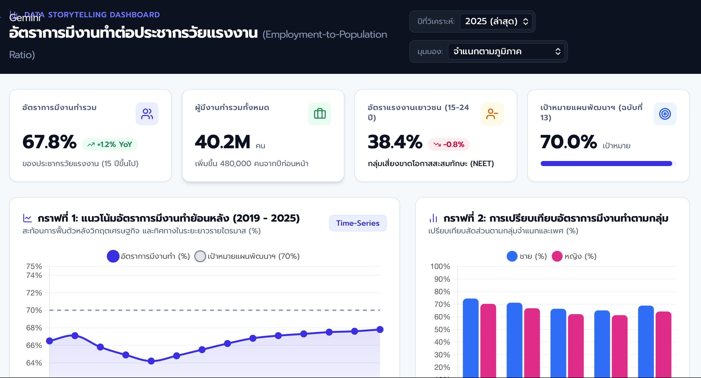

</div>


---

## Key Takeaways

- ใช้ Gemini เพื่อเร่งขั้นตอนวิเคราะห์ ไม่ใช่แทนผู้วิเคราะห์
- Prompt ที่ชัด + Context ที่เพียงพอ + Human Verification = ผลลัพธ์ที่ใช้งานได้จริง
- ข้อมูลที่มีความซับซ้อน และมีขนาดใหญ่ ควรใช้เครื่องมืออื่นเช่น Colab หรือ Jupyter Notebook ร่วมกับ Gemini


---

<!-- _class: lead -->

# Q&A

---

## วิทยากร


**ผศ.ดร.ทวีศักดิ์ สมานชื่น**
*Asst. Prof. Taweesak Samanchuen, Ph.D.*

- รองผู้อำนวยการฝ่ายดิจิทัลเทคโนโลยี **MULKC**
- อาจารย์ประจำสาขา **ITM** คณะวิศวกรรมศาสตร์ มหาวิทยาลัยมหิดล
- หัวหน้าโครงการ **CBTU** 

🔗 [Profile](https://itm.eg.mahidol.ac.th/personnel/taweesak-samanchuen/)  
📧 t.samanchuen@gmail.com
☎ 081-441-4906

websit: [cbtumu.net](https://cbtumu.net) | facebook: [cbtumu](https://www.facebook.com/CBTUMU/)


---

<!-- _class: lead -->

# ขอบคุณครับ

**ผศ.ดร.ทวีศักดิ์ สมานชื่น**
