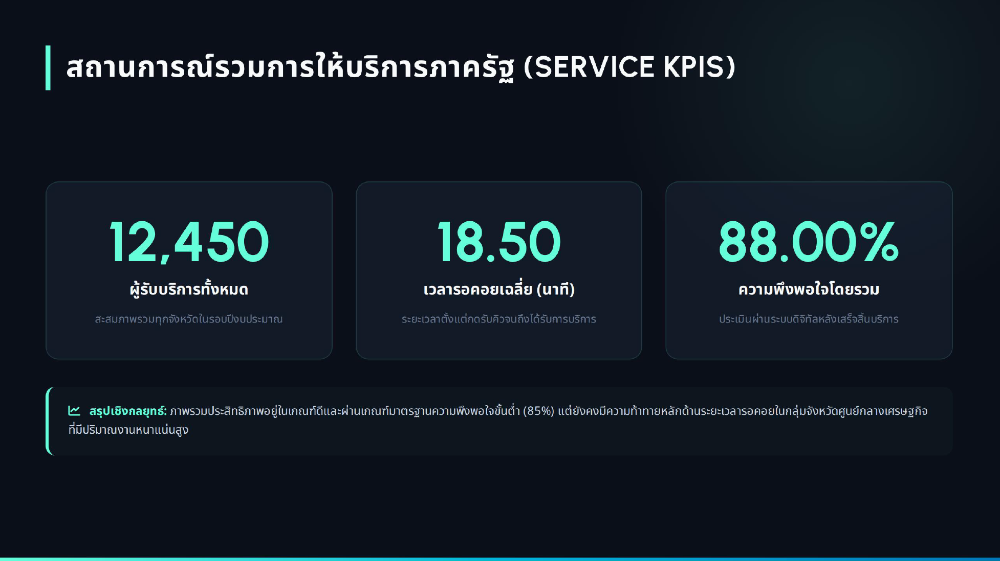
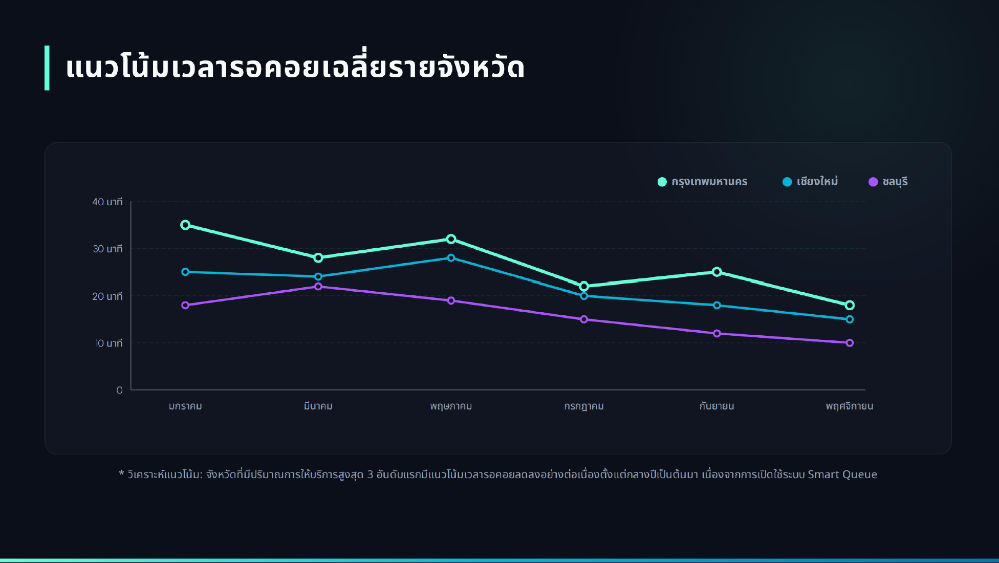
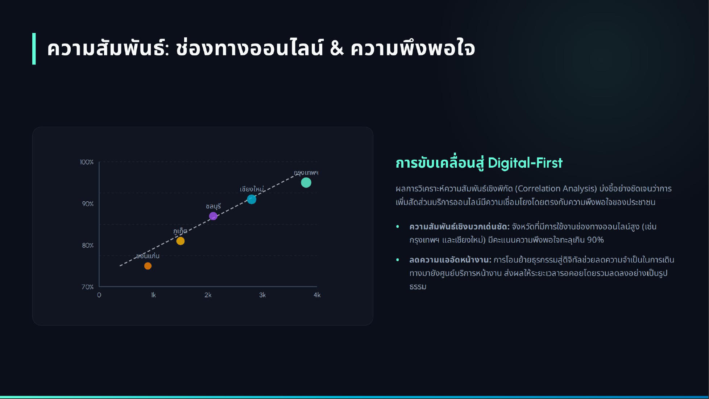
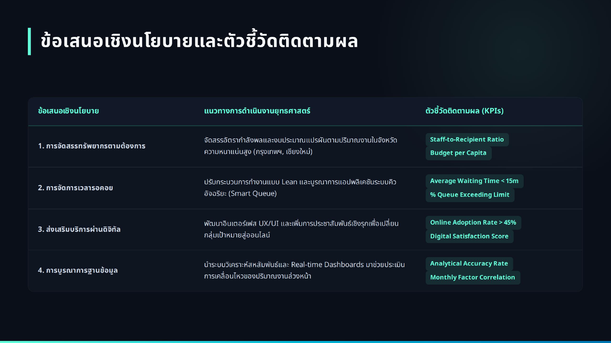

<!-- _class: lead -->

<style scoped>
.logo-bar { position: absolute; top: 36px; right: 64px; display: flex; align-items: center; gap: 16px; }
.logo-bar img { width: 250px; height: 100px; object-fit: contain; }
</style>

<div class="logo-bar">
  
</div>

# Session 04

# AI-Assisted Reporting and Presentation

หลักสูตร: การใช้ Generative AI เพื่อการวิเคราะห์ข้อมูลสำหรับภาครัฐ

Asst. Prof. Taweesak Samanchuen, Ph.D.
Mahidol University

---

## วัตถุประสงค์ของ Session

เมื่อจบช่วงนี้ ผู้เข้าอบรมสามารถ:

1. ใช้ AI ช่วยเขียนรายงานวิเคราะห์ข้อมูลอย่างเป็นระบบ
2. สรุป Insight สำหรับผู้บริหารในรูปแบบ Executive Summary
3. ออกแบบสไลด์นำเสนอผลวิเคราะห์ให้กระชับและน่าเชื่อถือ
4. สื่อสารข้อเสนอเชิงนโยบายจากข้อมูลได้ชัดเจน

---

## ภาพรวมเนื้อหา

1. การใช้ AI ช่วยเขียนรายงานวิเคราะห์ข้อมูล
2. Executive Summary ที่ผู้บริหารอ่านแล้วตัดสินใจได้
3. การสร้างสไลด์นำเสนอผลวิเคราะห์ด้วย AI
4. เทคนิคการสื่อสารเพื่อสนับสนุนการตัดสินใจ


--- 

## แพลตฟอร์มที่ใช้
1. Gemini in Colab: ช่วยคิด วิเคราะห์ และเขียนโค้ดในโน้ตบุ๊กเดียว
2. GitHub Raw CSV: ใช้เป็นแหล่งข้อมูลกลางให้ทุกคนโหลดข้อมูลชุดเดียวกัน
3. Visualization Libraries: ใช้ `pandas`, `matplotlib`, `seaborn` สำหรับสร้างกราฟประกอบรายงานและสไลด์
4. Google Slides หรือ PowerPoint: สำหรับจัดทำสไลด์นำเสนอผลวิเคราะห์
5. ChatGPT หรือ Gemini: ใช้ช่วยเขียนรายงานและสไลด์ให้กระชับและเป็นทางการมากขึ้น

---

## ชุดข้อมูลตัวอย่างสำหรับ Session 04

ใช้ข้อมูลจาก `https://raw.githubusercontent.com/toche7/DataSets/main/session-03-workshop-sample-data.csv`


- หน่วยข้อมูล: รายเดือน (2026-01 ถึง 2026-06)
- พื้นที่: กรุงเทพมหานคร, เชียงใหม่, ขอนแก่น, สงขลา
- ตัวแปรหลัก: ผู้รับบริการทั้งหมด, ออนไลน์, เวลารอเฉลี่ย, ความพึงพอใจ

### คำถามเชิงนโยบายที่ต้องตอบ

1. พื้นที่ใดควรเร่งลดเวลารอคิวมากที่สุด
2. การเพิ่มช่องทางออนไลน์สัมพันธ์กับความพึงพอใจหรือไม่
3. ควรจัดลำดับทรัพยากรในไตรมาสถัดไปอย่างไร

---
## กระบวนการทำงานที่แนะนำ

1. วิเคราะห์ข้อมูลและสร้างกราฟด้วย Colab
2. สรุปข้อค้นพบสำคัญด้วย AI ช่วยเขียนรายงาน
3. `เขียนรายงานตามโครงสร้าง โดยข้ามส่วนของ Executive Summary ไว้ก่อน` 
4. สร้าง Executive Summary สำหรับผู้บริหาร
5. ออกแบบสไลด์นำเสนอผลวิเคราะห์ด้วย AI
6. ซ้อมนำเสนอและเตรียมตอบคำถาม

---

## 1) AI-Assisted Reporting

### โครงสร้างรายงานที่แนะนำ

- บทสรุปผู้บริหาร (Executive Summary) [เขียนทีหลัง]
- กำหนดหัวข้อหรือโครงการ
- วัตถุประสงค์และคำถามวิเคราะห์
- ข้อมูลและวิธีการ
- ผลการวิเคราะห์และข้อค้นพบ
- ข้อเสนอแนะเชิงปฏิบัติ
- ข้อจำกัดของข้อมูล/การวิเคราะห์


---

## Prompt ตัวอย่างสำหรับรายงาน

- ให้ค่อย ๆ เขียนเป็นส่วนก่อน และตรวจสอบว่าตรงตามความต้องการหรือไม่ 
- ทำการใส่ข้อมูลที่เตรียมไว้เพื่อให้ AI ทราบข้อมูลได้ถูกต้อง

### ตัวอย่าง Prompt สำหรับรายงาน 2 ส่วนแรก
```prompt
คุณคือ Data Analyst ภาครัฐ
ช่วยเขียนรายงานการวิเคราะห์ข้อมูลบริการประชาชน 4 จังหวัด (ข้อมูล 6 เดือน) โดยมีโครงสร้างดังนี้:
1) หัวข้อหรือโครงการ
2) วัตถุประสงค์และคำถามวิเคราะห์
```


---

## Prompt ตัวอย่างสำหรับรายงาน (ต่อ)

- เมื่อได้ส่วนที่ 1-2 แล้ว ก็ให้เขียนส่วนที่เหลือ โดยอิงจากข้อมูลที่ได้วิเคราะห์ใน Colab

### ตัวอย่าง Prompt สำหรับรายงาน 2 ส่วนแรก
```prompt
เขียนส่วน 3-6 ของรายงานการวิเคราะห์ข้อมูลบริการประชาชน 4 จังหวัด (ข้อมูล 6 เดือน) โดยมีโครงสร้างดังนี้:
3) ข้อมูลและวิธีการ
4) ผลการวิเคราะห์และข้อค้นพบ
5) ข้อเสนอแนะเชิงปฏิบัติ
6) ข้อจำกัดของข้อมูล/การวิเคราะห์
```


 

---

## 2) Executive Summary

### องค์ประกอบสำคัญ

1. ประเด็นสำคัญที่สุด 2-3 ข้อ
2. หลักฐานเชิงข้อมูลที่รองรับ
3. ผลกระทบต่อการดำเนินงาน
4. ข้อเสนอแนะที่นำไปทำต่อได้ทันที

### รูปแบบการเขียน

- ใช้ภาษาสั้น กระชับ ตรงประเด็น
- ระบุขอบเขตและข้อจำกัดให้ครบถ้วน
- แยก "ข้อเท็จจริง" ออกจาก "ข้อเสนอ" ชัดเจน

---

## ตัวอย่าง: Executive Summary

### Example question

- ถ้าต้องสรุปให้ผู้บริหารตัดสินใจใน 1 หน้า ควรเน้นตัวเลขใดบ้าง

### Recommended chart or method

- KPI card 4 ค่า: ผู้รับบริการรวม, สัดส่วนออนไลน์, เวลารอเฉลี่ย, ความพึงพอใจ
- Heatmap จังหวัด x ตัวชี้วัด เพื่อเห็นจุดแข็ง/จุดเสี่ยงเร็ว

### Short interpretation (ภาครัฐ)

- สัดส่วนออนไลน์เพิ่มในทุกจังหวัด สะท้อนการยอมรับช่องทางดิจิทัล
- เวลารอลดลงพร้อมความพึงพอใจเพิ่มขึ้น สื่อถึงคุณภาพบริการที่ดีขึ้น
- ควรตั้งเป้าหมายรายจังหวัด แทนการใช้เป้าหมายเดียวทั้งประเทศ

---

### Prompt (Gemini / ChatGPT)

```prompt
เขียน Executive Summary ภาษาไทยสำหรับผู้บริหารภาครัฐ 
โครงสร้างบังคับ:
1) สาระสำคัญ 3 ข้อ
2) ผลกระทบต่อการดำเนินงาน
3) ข้อเสนอเชิงนโยบาย 3 เดือนข้างหน้า
ข้อกำหนด:
- ใส่ตัวเลขหลักฐานอย่างน้อย 4 ค่า
- แยก "ข้อเท็จจริง" และ "ข้อเสนอ" ชัดเจน
- ความยาวไม่เกิน 220 คำ
```

- ให้ทำต่อใน chat เดียวกับเขียนรายงาน เพื่อให้ AI เข้าใจบริบทได้ดีขึ้น

---

## 3) การสร้างสไลด์ด้วย AI

### Workflow ที่แนะนำ

1. สกัดสารสำคัญจากรายงาน
2. จัดลำดับเรื่อง: ปัญหา -> หลักฐาน -> ทางเลือก -> ข้อเสนอ
3. ให้ AI ช่วยย่อเนื้อหาเป็น bullet ที่อ่านง่าย
4. ตรวจทานความถูกต้องเชิงเนื้อหาอีกครั้ง

### แนวคิดการออกแบบ

- 1 สไลด์ = 1 ประเด็นหลัก
- ใช้กราฟที่เชื่อมกับข้อสรุปโดยตรง
- จำกัดข้อความให้ผู้ฟังตามทัน

---

## ตัวอย่าง: สไลด์สำหรับผู้บริหาร

### Example question

- จะเล่าเรื่องอย่างไรให้ตัดสินใจได้ภายใน 5 นาที


### Short interpretation (ภาครัฐ)

- ข้อมูลชี้ว่า "ดิจิทัลมากขึ้น" ไปในทิศทางเดียวกับ "ความพึงพอใจดีขึ้น"
- ต้องใช้มาตรการเฉพาะพื้นที่ที่ยังรอคิวนาน เพื่อปิดช่องว่างคุณภาพบริการ

---
## Recommended chart or method

- Slide 1: สถานการณ์รวม (KPI card)
- Slide 2: แนวโน้มเวลารอรายจังหวัด (line chart)
- Slide 3: ออนไลน์ vs ความพึงพอใจ (scatter plot)
- Slide 4: ข้อเสนอเชิงนโยบายพร้อมตัวชี้วัดติดตามผล

ตัวอย่างต่อไปนี้ได้จากการใช้ Prompt ใน Gemini เพื่อสร้างสไลด์นำเสนอจากรายงานที่เขียนไว้ก่อนหน้านี้

---



---



---



---



---

### Prompt (Gemini / ChatGPT)

```prompt
สร้างโครงสไลด์ 6 หน้า สำหรับผู้บริหารภาครัฐ จากผลวิเคราะห์บริการประชาชน 4 จังหวัด (นำเข้าจาก Colab)
ลำดับเรื่อง: ปัญหา -> หลักฐาน -> ทางเลือก -> ข้อเสนอ
ระบุในแต่ละสไลด์:
- ชื่อสไลด์ (ไม่เกิน 8 คำ)
- key message 1 ประโยค
- กราฟที่ควรใช้
น้ำเสียง: กระชับ น่าเชื่อถือ พร้อมใช้ประชุม
```

---

## 4) เทคนิคการสื่อสารเพื่อการตัดสินใจ

### สื่อสารให้เกิด Action

- ระบุ "สิ่งที่ควรทำต่อ" อย่างชัดเจน
- แสดงทางเลือกพร้อมผลดี-ผลเสี่ยง
- ใช้ตัวเลขสำคัญเพื่อยืนยันน้ำหนักของข้อเสนอ
- เตรียมคำตอบสำหรับคำถามคาดการณ์ล่วงหน้า

### ตัวอย่างประโยคปิดการนำเสนอ

> "ข้อเสนอที่เหมาะสมที่สุดในระยะ 3 เดือน คือ ... โดยใช้ตัวชี้วัด ... เพื่อติดตามผล"

---

## ตัวอย่างข้อความสื่อสารเชิงนโยบาย

### Example question

- จะพูด "ข้อเสนอ" อย่างไรให้ผู้บริหารสั่งการต่อได้ทันที

### Recommended chart or method

- Decision table: ทางเลือก | ผลที่คาด | ความเสี่ยง | ทรัพยากรที่ต้องใช้

### Short interpretation (ภาครัฐ)

- ระยะสั้น: เพิ่มช่วงเวลาให้บริการออนไลน์ในจังหวัดที่คิวหนาแน่น
- ระยะกลาง: ยกระดับการนัดหมายล่วงหน้าเพื่อลดคอขวดหน้าจุดบริการ
- ระยะติดตามผล: ใช้ 3 KPI เดียวกันทุกจังหวัดเพื่อเทียบผลรายเดือน

---

### Prompt (Gemini / ChatGPT)

```prompt
จากข้อค้นพบเรื่องเวลารอและความพึงพอใจ 
ช่วยร่าง "ข้อเสนอเชิงนโยบาย" 3 ทางเลือก
รูปแบบต่อทางเลือก:
- มาตรการ
- ผลที่คาดภายใน 3 เดือน
- ความเสี่ยง
- KPI ติดตามผล 2 ตัว
เขียนให้ผู้ว่าราชการจังหวัดอ่านแล้วสั่งการต่อได้ทันที
```

---

## Workshop 8

### กิจกรรมฝึกปฏิบัติ
1. เลือกคำถามวิเคราะห์จาก Session 02
2. ออกแบบกราฟอย่างน้อย 3 แบบ
3. ใช้ Gemini in Colab ช่วยสร้าง/ปรับโค้ด
4. สรุปข้อความ insight ต่อกราฟละ 1-2 ประโยค
5. เขียนรายงานสั้น ๆ พร้อม Executive Summary
6. สร้างสไลด์นำเสนอผลวิเคราะห์ด้วย AI (6 หน้า)
7. ซ้อมนำเสนอและเตรียมตอบคำถาม

---

### Runnable snippet (Colab)

```python
import pandas as pd

df = pd.read_csv('session-03-workshop-sample-data.csv')
df['สัดส่วนออนไลน์(%)'] = (df['จำนวนผ่านช่องทางออนไลน์(คน)'] / df['จำนวนผู้รับบริการทั้งหมด(คน)'] * 100).round(1)

summary = df.groupby('จังหวัด').agg({
  'เวลารอเฉลี่ย(นาที)': ['first', 'last'],
  'ความพึงพอใจ(%)': ['first', 'last'],
  'สัดส่วนออนไลน์(%)': ['first', 'last']
})
print(summary)
```
---

### Prompt ใช้ใน Workshop

```prompt
ฉันมีผลสรุปตัวชี้วัดรายจังหวัดจาก Colab (first vs last)
ช่วยเขียน:
1) Insight 5 ข้อ
2) Executive Summary แบบ 1 หน้า
3) Outline สไลด์นำเสนอ 6 หน้า
เงื่อนไข: ทุกข้อสรุปต้องผูกกับตัวเลข และปิดท้ายด้วยข้อเสนอเชิงปฏิบัติ 3 เดือน
```

### ผลลัพธ์ที่คาดหวัง

- รายงานย่อพร้อมข้อเสนอเชิงนโยบาย
- ชุดสไลด์ที่พร้อมใช้ในการประชุมจริง

---

## สรุป Session 04

- รายงานที่ดีต้องพาไปสู่การตัดสินใจได้
- AI ช่วยเพิ่มความเร็วและคุณภาพการสื่อสาร
- ความน่าเชื่อถือเกิดจากข้อมูลที่ตรวจสอบได้และข้อเสนอที่ทำได้จริง

---

<!-- _class: lead -->

# Q&A

---

## วิทยากร


**ผศ.ดร.ทวีศักดิ์ สมานชื่น**
*Asst. Prof. Taweesak Samanchuen, Ph.D.*

- รองผู้อำนวยการฝ่ายดิจิทัลเทคโนโลยี **MULKC**
- อาจารย์ประจำสาขา **ITM** คณะวิศวกรรมศาสตร์ มหาวิทยาลัยมหิดล
- หัวหน้าโครงการ **CBTU** 

🔗 [Profile](https://itm.eg.mahidol.ac.th/personnel/taweesak-samanchuen/)  
📧 t.samanchuen@gmail.com
☎ 081-441-4906

websit: [cbtumu.net](https://cbtumu.net) | facebook: [cbtumu](https://www.facebook.com/CBTUMU/)


---

<!-- _class: lead -->

# ขอบคุณครับ

**ผศ.ดร.ทวีศักดิ์ สมานชื่น**
